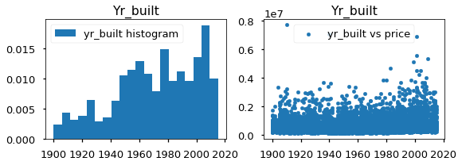
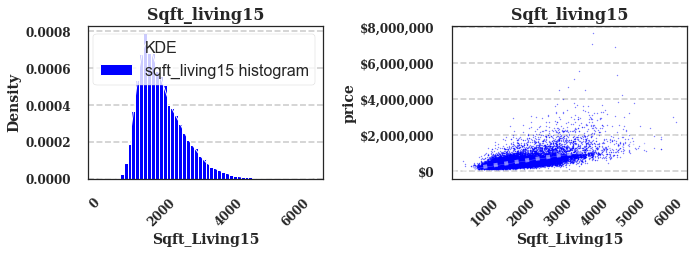
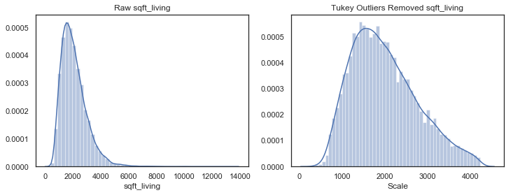

# Final Project Submission

Please fill out:
* Student name:  James M. Irving
* Student pace:  full time
* Scheduled project review date/time:  03/08/19 at 12pm
* Instructor name: Jeff Herman
* Blog post URL: https://jirvingphd.github.io/harnessing_seaborn_subplots_for_eda
___

<h1>Table of Contents (Links)<span class="tocSkip"></span></h1>
<div class="toc"><ul class="toc-item"><li><span><a href="#Final-Project-Submission" data-toc-modified-id="Final-Project-Submission-1">Final Project Submission</a></span></li><li><span><a href="#FINAL-SUMMARY-FIGURES-FROM-PRESENTATION" data-toc-modified-id="FINAL-SUMMARY-FIGURES-FROM-PRESENTATION-2">FINAL SUMMARY FIGURES FROM PRESENTATION</a></span></li><li><span><a href="#Outline-of-Data-Processing-and-Analysis(using-OSEMN-model)" data-toc-modified-id="Outline-of-Data-Processing-and-Analysis(using-OSEMN-model)-3">Outline of Data Processing and Analysis(using OSEMN model)</a></span></li><li><span><a href="#OBTAIN:" data-toc-modified-id="OBTAIN:-4">OBTAIN:</a></span></li><li><span><a href="#SCRUB:" data-toc-modified-id="SCRUB:-5">SCRUB:</a></span><ul class="toc-item"><li><span><a href="#Fill-in-null-values-and-recast-variables-for-EDA" data-toc-modified-id="Fill-in-null-values-and-recast-variables-for-EDA-5.1">Fill in null values and recast variables for EDA</a></span></li><li><span><a href="#Question-1:-Which-predictors-should-be-analyzed-as-continuous-data,-vs-binned/categorical-data?" data-toc-modified-id="Question-1:-Which-predictors-should-be-analyzed-as-continuous-data,-vs-binned/categorical-data?-5.2">Question 1: Which predictors should be analyzed as continuous data, vs binned/categorical data?</a></span></li><li><span><a href="#COARSE-BINNING-Numerical-Data" data-toc-modified-id="COARSE-BINNING-Numerical-Data-5.3">COARSE-BINNING Numerical Data</a></span></li><li><span><a href="#CHECKING-FOR-MULTICOLLINEARITY" data-toc-modified-id="CHECKING-FOR-MULTICOLLINEARITY-5.4">CHECKING FOR MULTICOLLINEARITY</a></span></li></ul></li><li><span><a href="#EXPLORE:" data-toc-modified-id="EXPLORE:-6">EXPLORE:</a></span><ul class="toc-item"><li><span><a href="#EDA-before-normalization/transformation" data-toc-modified-id="EDA-before-normalization/transformation-6.1">EDA before normalization/transformation</a></span></li></ul></li><li><span><a href="#[SCRUB-2]-NORMALIZING-&amp;-TRANSFORMING" data-toc-modified-id="[SCRUB-2]-NORMALIZING-&amp;-TRANSFORMING-7">[SCRUB-2] NORMALIZING &amp; TRANSFORMING</a></span><ul class="toc-item"><li><span><a href="#Outlier-Removal---visualizing" data-toc-modified-id="Outlier-Removal---visualizing-7.1">Outlier Removal - visualizing</a></span></li><li><span><a href="#REMOVING-OUTLIERS" data-toc-modified-id="REMOVING-OUTLIERS-7.2">REMOVING OUTLIERS</a></span></li><li><span><a href="#NORMALIZING-UNITS-(RobustScaler)" data-toc-modified-id="NORMALIZING-UNITS-(RobustScaler)-7.3">NORMALIZING UNITS (RobustScaler)</a></span></li></ul></li><li><span><a href="#CHECKING-NORMALIZED-DATASET" data-toc-modified-id="CHECKING-NORMALIZED-DATASET-8">CHECKING NORMALIZED DATASET</a></span><ul class="toc-item"><li><span><a href="#Recheck-multipol" data-toc-modified-id="Recheck-multipol-8.1">Recheck multipol</a></span></li><li><span><a href="#CAT.CODES-FOR-BINNED-DATA" data-toc-modified-id="CAT.CODES-FOR-BINNED-DATA-8.2">CAT.CODES FOR BINNED DATA</a></span></li><li><span><a href="#Concatenate-final-df-for-modeling-(df_run)" data-toc-modified-id="Concatenate-final-df-for-modeling-(df_run)-8.3">Concatenate final df for modeling (df_run)</a></span></li></ul></li><li><span><a href="#FITTING-AN-INTIAL-MODEL:" data-toc-modified-id="FITTING-AN-INTIAL-MODEL:-9">FITTING AN INTIAL MODEL:</a></span><ul class="toc-item"><li><span><a href="#DETERMINING-IDEAL-FEATURES-TO-USE" data-toc-modified-id="DETERMINING-IDEAL-FEATURES-TO-USE-9.1">DETERMINING IDEAL FEATURES TO USE</a></span></li><li><span><a href="#PRELIMINARY-UNIVARIATE-LINEAR-REGRESSION-MODELING" data-toc-modified-id="PRELIMINARY-UNIVARIATE-LINEAR-REGRESSION-MODELING-9.2">PRELIMINARY UNIVARIATE LINEAR REGRESSION MODELING</a></span></li><li><span><a href="#MULTIVARIATE-REGRESSIONS" data-toc-modified-id="MULTIVARIATE-REGRESSIONS-9.3">MULTIVARIATE REGRESSIONS</a></span></li><li><span><a href="#Cross-Validation-with-K-Fold-Test-Train-Splits:" data-toc-modified-id="Cross-Validation-with-K-Fold-Test-Train-Splits:-9.4">Cross-Validation with K-Fold Test-Train Splits:</a></span></li></ul></li><li><span><a href="#FINAL-REGRESSION-RESULTS" data-toc-modified-id="FINAL-REGRESSION-RESULTS-10">FINAL REGRESSION RESULTS</a></span><ul class="toc-item"><li><span><a href="#K-Fold-valiation-with-OLS" data-toc-modified-id="K-Fold-valiation-with-OLS-10.1">K-Fold valiation with OLS</a></span></li><li><span><a href="#Q-Q-Plots" data-toc-modified-id="Q-Q-Plots-10.2">Q-Q Plots</a></span></li></ul></li><li><span><a href="#FINAL-MODEL---New" data-toc-modified-id="FINAL-MODEL---New-11">FINAL MODEL - New</a></span><ul class="toc-item"><li><span><a href="#Predictor-Coefficients-&amp;-Their-Affect-On-Sales-Price" data-toc-modified-id="Predictor-Coefficients-&amp;-Their-Affect-On-Sales-Price-11.1">Predictor Coefficients &amp; Their Affect On Sales Price</a></span></li><li><span><a href="#Future-Directions" data-toc-modified-id="Future-Directions-11.2">Future Directions</a></span></li></ul></li><li><span><a href="#SUMMARY-FIGURE-CODE-FOR-PRESENTATION" data-toc-modified-id="SUMMARY-FIGURE-CODE-FOR-PRESENTATION-12">SUMMARY FIGURE CODE FOR PRESENTATION</a></span></li><li><span><a href="#END-OF-PROJECT-1-RE-SUBMISSION" data-toc-modified-id="END-OF-PROJECT-1-RE-SUBMISSION-13">END OF PROJECT 1 RE-SUBMISSION</a></span></li></ul></div>

---
# FINAL SUMMARY FIGURES FROM PRESENTATION


### HOW TO: Tableau Maps were from final .csv loaded into Tableau Public and can be viewed and downloaded from  https://public.tableau.com/profile/james.irving#!/ 

#### Short how-to plot geo data in Tableau: 
- Load in your .csv dataset from your project.
    - Let it use data interpreter. It should identify zipcode as a location.
- On your worksheet page:
    - **For plotting each price for each house:**
        - Drag the Measures Lat and Long onto the rows and columns boxes (top of sheet)
        - Drag the Measure price onto the Color Button under Marks. <br> It should now be listed at the bottom of the Marks panel. 
        - Right-click and select "Dimension"
    - **For plotting median income by zipcode:**
        - Drag zipcode form the Dimensions panel onto the main graph window. 
            - It will automatically load in map of location.
        - Drag price onto the color button (it will now appear in the Marks window)
        - Rich click on Price. Select "Measure" > Median
    - **Customize map features** by selecting "Map" > Map Layers on the Menu Bar. 
    ___

# Outline of Data Processing and Analysis(using OSEMN model)

1. **OBTAIN:** 
    **Import data, inspect, check for datatypes to convert and null values**
    - Display header and info
    - Drop any unneeded columns (df.drop(['col1','col2'],axis=1)

2. **SCRUB: cast data types, identify outliers, check for multicollinearity, normalize data**
    - Check and cast data types
        - [x] Check for #'s that are store as objects (df.info())
            - when converting to #'s, look for odd values (like many 0's), or strings that can't be converted
            - Decide how to deal weird/null values (df.unique(), df.isna().sum(), df.describe()-min/max, etc
        - [x]  Check for categorical variables stored as integers
    - [x] Check for missing values  (df.isna().sum())
        - Can drop rows or colums
        - For missing numeric data with median or bin/convert to categorical
        - For missing categorical data: make NaN own category OR replace with most common category
    - [X] Check for multicollinearity
         - use seaborn to make correlation matrix plot [Evernote Link](https://www.evernote.com/l/AArNyaEwjA5JUL6I9PazHs_ts_hU-m7ja1I/) 
        - Good rule of thumb is anything over 0.75 corr is high, remove the variable that has the most correl with the largest # of variables
    - [x] Normalize data (may want to do after some exploring)
        - Most popular is Z-scoring (but won't fix skew) 
        - Can log-transform to fix skewed data
    
            
3. **EXPLORE:Check distributions, outliers, etc**
    - [ ] Check scales, ranges (df.describe())
    - [x] Check histograms to get an idea of distributions (df.hist()) and dat transformations to perform
        - Can also do kernel density estimates
    - [x] Use scatterplots to check for linearity and possible categorical variables (df.plot(kind-'scatter')
        - categoricals will look like vertical lines
    - [x] Use pd.plotting.scatter_matrix to visualize possible relationships
    - [x] Check for linearity

   
4. **FIT AN INITIAL MODEL:** 
    - Various forms, detail later...
    - **Assessing the model:**
        - Assess parameters (slope,intercept)
        - Check if the model explains the variation in the data (RMSE, F, R_square)
        - *Are the coeffs, slopes, intercepts in appropriate units?*
        - *Whats the impact of collinearity? Can we ignore?*
5. **Revise the fitted model**
    - Multicollinearity is big issue for lin regression and cannot fully remove it
    - Use the predictive ability of model to test it (like R2 and RMSE)
    - Check for missed non-linearity
6. **Holdout validation / Train/test split**
    - use sklearn train_test_split 
___

# OBTAIN:
 - Import required packages, read in dataframe, and definefunctions


```python
from _functions_jirving import *
df = pd.read_csv('kc_house_data.csv')   
# Set index, create dataframe for dropped variables with id as index for both
# df.set_index=('id')
drop_me =['id','lat','long','date']
df_dropped = df[drop_me].copy()
df_dropped.set_index('id')
df.drop(drop_me,axis=1,inplace=True)
```

### NOTE TO USER: SAVED FILES.
- The below cell determines the output filepaths and should not be altered unless you intend to change those locations


```python
folder = %pwd
fig_filepath = folder+'/Figures/'
data_filepath = folder+'/Data/'
```


```python
df.index
```


    RangeIndex(start=0, stop=21597, step=1)


# SCRUB:

#### Initial inspection of dataframe, datatypes, and null values


```python
df.head()
```


<div>
<style scoped>
    .dataframe tbody tr th:only-of-type {
        vertical-align: middle;
    }

    .dataframe tbody tr th {
        vertical-align: top;
    }

    .dataframe thead th {
        text-align: right;
    }
</style>
<table border="1" class="dataframe">
  <thead>
    <tr style="text-align: right;">
      <th></th>
      <th>price</th>
      <th>bedrooms</th>
      <th>bathrooms</th>
      <th>sqft_living</th>
      <th>sqft_lot</th>
      <th>floors</th>
      <th>waterfront</th>
      <th>view</th>
      <th>condition</th>
      <th>grade</th>
      <th>sqft_above</th>
      <th>sqft_basement</th>
      <th>yr_built</th>
      <th>yr_renovated</th>
      <th>zipcode</th>
      <th>sqft_living15</th>
      <th>sqft_lot15</th>
    </tr>
  </thead>
  <tbody>
    <tr>
      <th>0</th>
      <td>221900.0</td>
      <td>3</td>
      <td>1.00</td>
      <td>1180</td>
      <td>5650</td>
      <td>1.0</td>
      <td>NaN</td>
      <td>0.0</td>
      <td>3</td>
      <td>7</td>
      <td>1180</td>
      <td>0.0</td>
      <td>1955</td>
      <td>0.0</td>
      <td>98178</td>
      <td>1340</td>
      <td>5650</td>
    </tr>
    <tr>
      <th>1</th>
      <td>538000.0</td>
      <td>3</td>
      <td>2.25</td>
      <td>2570</td>
      <td>7242</td>
      <td>2.0</td>
      <td>0.0</td>
      <td>0.0</td>
      <td>3</td>
      <td>7</td>
      <td>2170</td>
      <td>400.0</td>
      <td>1951</td>
      <td>1991.0</td>
      <td>98125</td>
      <td>1690</td>
      <td>7639</td>
    </tr>
    <tr>
      <th>2</th>
      <td>180000.0</td>
      <td>2</td>
      <td>1.00</td>
      <td>770</td>
      <td>10000</td>
      <td>1.0</td>
      <td>0.0</td>
      <td>0.0</td>
      <td>3</td>
      <td>6</td>
      <td>770</td>
      <td>0.0</td>
      <td>1933</td>
      <td>NaN</td>
      <td>98028</td>
      <td>2720</td>
      <td>8062</td>
    </tr>
    <tr>
      <th>3</th>
      <td>604000.0</td>
      <td>4</td>
      <td>3.00</td>
      <td>1960</td>
      <td>5000</td>
      <td>1.0</td>
      <td>0.0</td>
      <td>0.0</td>
      <td>5</td>
      <td>7</td>
      <td>1050</td>
      <td>910.0</td>
      <td>1965</td>
      <td>0.0</td>
      <td>98136</td>
      <td>1360</td>
      <td>5000</td>
    </tr>
    <tr>
      <th>4</th>
      <td>510000.0</td>
      <td>3</td>
      <td>2.00</td>
      <td>1680</td>
      <td>8080</td>
      <td>1.0</td>
      <td>0.0</td>
      <td>0.0</td>
      <td>3</td>
      <td>8</td>
      <td>1680</td>
      <td>0.0</td>
      <td>1987</td>
      <td>0.0</td>
      <td>98074</td>
      <td>1800</td>
      <td>7503</td>
    </tr>
  </tbody>
</table>
</div>


```python
# Display DataFrame Infro
df.info()
```

    <class 'pandas.core.frame.DataFrame'>
    RangeIndex: 21597 entries, 0 to 21596
    Data columns (total 17 columns):
    price            21597 non-null float64
    bedrooms         21597 non-null int64
    bathrooms        21597 non-null float64
    sqft_living      21597 non-null int64
    sqft_lot         21597 non-null int64
    floors           21597 non-null float64
    waterfront       19221 non-null float64
    view             21534 non-null float64
    condition        21597 non-null int64
    grade            21597 non-null int64
    sqft_above       21597 non-null int64
    sqft_basement    21597 non-null object
    yr_built         21597 non-null int64
    yr_renovated     17755 non-null float64
    zipcode          21597 non-null int64
    sqft_living15    21597 non-null int64
    sqft_lot15       21597 non-null int64
    dtypes: float64(6), int64(10), object(1)
    memory usage: 2.8+ MB


```python
# Check for columns with null values (remember strings/objects are not counted here)
res = df.isna().sum()
print(res[res>0],'\nTotal:',len(df))
# Waterfront, view, yr_renovated have missing values
```

    waterfront      2376
    view              63
    yr_renovated    3842
    dtype: int64 
    Total: 21597


## Fill in null values and recast variables for EDA
- From examining the df.info and df.isna().sum(), there is 1 numerical data column that is currently text/object data type. 
    - I will address these first since they would be excluded from preliminary visualizations.
- There are also null values to address in waterfront, view, and yr_renovated
- The Date column will be recast as datetime

### zipcode


```python
# Recast zipcode as a category
df['zipcode'] = df['zipcode'].astype('category')
```

### sqft_basement


```python
# RECASTING SQFT_BASEMENT
# Checking why sqft_basement might be an object:
# df['sqft_basement'].value_counts().nlargest(10)
check_column(df['sqft_basement'],10)
```

    Column: df['sqft_basement']':
    dtype: object
    isna: 0 out of 21597 - 0.0%
    
    Unique non-na values:
    0.0       12826
    ?           454
    600.0       217
    500.0       209
    700.0       208
    800.0       201
    400.0       184
    1000.0      148
    900.0       142
    300.0       142
    Name: sqft_basement, dtype: int64


- **sqft_basement is current an object, needs to be converted to int**
    - Need to ~~replace~~ drop the 454 '?' values
    - There are a lot of 0's, for sqft_basement. Not sure if I should keep them in the dataset. I am for now.
    - _Note: I originally replaced the ?'s with 0's, but am re-running the dataset with them dropped altogether._


```python
# Removing rows with ? for sqft_basement and converting to float
print(len(df))
df['sqft_basement'].replace(to_replace = '?',value=np.nan,inplace=True) #,inplace=True)
df.dropna(axis=0,subset=['sqft_basement'],inplace=True)
df['sqft_basement'] = df['sqft_basement'].astype('float')
df['sqft_basement'].isna().sum()
check_column(df['sqft_basement'],10)
```

    21597
    Column: df['sqft_basement']':
    dtype: float64
    isna: 0 out of 21143 - 0.0%
    
    Unique non-na values:
    0.0       12826
    600.0       217
    500.0       209
    700.0       208
    800.0       201
    400.0       184
    1000.0      148
    900.0       142
    300.0       142
    200.0       105
    Name: sqft_basement, dtype: int64


### View
- ~~Replace the 61 null values with appropriate value for data type~~
- Drop the 61 view null values


```python
# Check for columns with null values (remember strings/objects are not counted here)
res = df.isna().sum()
print(res[res>0])
# Waterfront, view, yr_renovated have missing values
```

    waterfront      2339
    view              61
    yr_renovated    3754
    dtype: int64


```python
check_column(df['view'])
```

    Column: df['view']':
    dtype: float64
    isna: 61 out of 21143 - 0.289%
    
    Unique non-na values:
    0.0    19018
    2.0      930
    3.0      496
    1.0      327
    4.0      311
    Name: view, dtype: int64


```python
# Drop null values from view and re-check column
print(len(df))
df.dropna(axis=0,subset=['view'],inplace=True)
print(len(df))
check_column(df['view'])
```

    21143
    21082
    Column: df['view']':
    dtype: float64
    isna: 0 out of 21082 - 0.0%
    
    Unique non-na values:
    0.0    19018
    2.0      930
    3.0      496
    1.0      327
    4.0      311
    Name: view, dtype: int64


```python
# Convert view to category and create a coded version called code_view
df['view'] = df['view'].astype('category')
df['code_view'] = df.view.cat.codes
df['code_view'].value_counts()
```


    0    19018
    2      930
    3      496
    1      327
    4      311
    Name: code_view, dtype: int64


```python
# Drop drop_me variable from main df, save in df_dropped
drop_me = 'view'
df_dropped[drop_me] = df[drop_me].copy()
df.drop(drop_me,axis=1,inplace=True)
```

### Waterfront
- Recast as ~~int~~ string
- Waterfront has 2339 null values to ~~replace.~~ make into **unordered and coded into "NaN"** category
    - Note this is string "NaN" not np.nan


```python
check_column(df['waterfront'])
```

    Column: df['waterfront']':
    dtype: float64
    isna: 2333 out of 21082 - 11.066%
    
    Unique non-na values:
    0.0    18608
    1.0      141
    Name: waterfront, dtype: int64


```python
# Convert waterfront to category, replace null values with "NaN"' string to make it a category
df['waterfront'] = df['waterfront'].astype('category')
df['waterfront'].replace(np.nan,"NaN",inplace=True)
df['waterfront'] = df['waterfront'].astype('category')
```


```python
# df['waterfront'].value_counts()
check_column(df['waterfront'],10)
```

    Column: df['waterfront']':
    dtype: category
    isna: 0 out of 21082 - 0.0%
    
    Unique non-na values:
    0.0    18608
    NaN     2333
    1.0      141
    Name: waterfront, dtype: int64


```python
# Turn waterfront into coded column 
df['code_waterfront'] = df.waterfront.cat.codes
check_column(df['code_waterfront'])
```

    Column: df['code_waterfront']':
    dtype: int8
    isna: 0 out of 21082 - 0.0%
    
    Unique non-na values:
    0    18608
    2     2333
    1      141
    Name: code_waterfront, dtype: int64


```python
# Drop drop_me variable from main df, save in df_dropped
drop_me = 'waterfront'
df_dropped[drop_me] = df[drop_me].copy()
df.drop(drop_me,axis=1,inplace=True)
```

### yr_renovated  --> is_reno
- yr_renovated has 3754 null values
    - Presumably this is because the homes were never renovated
    - ~~Will replace with 0.0~~ 
    - Replace all 0.0's with NaN
- Replacing yr_renovated with binary category based on it if has been renovated or not
    - Make new column 'is_reno'

##### Make is_reno category (0 or 1)


```python
check_column(df['yr_renovated'],10)
```

    Column: df['yr_renovated']':
    dtype: float64
    isna: 3742 out of 21082 - 17.75%
    
    Unique non-na values:
    0.0       16618
    2014.0       69
    2003.0       31
    2013.0       31
    2007.0       30
    2000.0       29
    2005.0       29
    1990.0       22
    2009.0       21
    2004.0       21
    Name: yr_renovated, dtype: int64


```python
# Fill in 0.0 yr_renovated as np.nan temporarily
df['yr_renovated'].replace(0.0,np.nan,inplace=True)

# Recheck for null values
check_column(df['yr_renovated'],10) #df.isna().sum()
```

    Column: df['yr_renovated']':
    dtype: float64
    isna: 20360 out of 21082 - 96.575%
    
    Unique non-na values:
    2014.0    69
    2013.0    31
    2003.0    31
    2007.0    30
    2000.0    29
    2005.0    29
    1990.0    22
    2009.0    21
    2004.0    21
    2006.0    20
    Name: yr_renovated, dtype: int64


```python
# Get indices of all np.nan values to be used for is_reno category below
idx_nan = df['yr_renovated'].loc[df['yr_renovated'].isna()].index
idx_notnan = df['yr_renovated'].loc[~df['yr_renovated'].isna()].index

# Make df['is_reno']
df['is_reno'] = df['yr_renovated'].copy
df['is_reno'][idx_nan] = 0
df['is_reno'][idx_notnan] = 1

check_column(df['is_reno'],10) 
```

    Column: df['is_reno']':
    dtype: int64
    isna: 0 out of 21082 - 0.0%
    
    Unique non-na values:
    0    20360
    1      722
    Name: is_reno, dtype: int64


    //anaconda3/envs/learn-env/lib/python3.6/site-packages/ipykernel_launcher.py:7: SettingWithCopyWarning: 
    A value is trying to be set on a copy of a slice from a DataFrame
    
    See the caveats in the documentation: http://pandas.pydata.org/pandas-docs/stable/user_guide/indexing.html#returning-a-view-versus-a-copy
      import sys
    //anaconda3/envs/learn-env/lib/python3.6/site-packages/ipykernel_launcher.py:8: SettingWithCopyWarning: 
    A value is trying to be set on a copy of a slice from a DataFrame
    
    See the caveats in the documentation: http://pandas.pydata.org/pandas-docs/stable/user_guide/indexing.html#returning-a-view-versus-a-copy
      


```python
# Drop drop_me variable from main df, save in df_dropped
drop_me = 'yr_renovated'
df_dropped[drop_me] = df[drop_me].copy()
df.drop(drop_me,axis=1,inplace=True)
```

### SCRUBBING THUS FAR...
- Removed null values by dropping na from sqft_basement and view. 
- Converted waterfront to category and made NaN its own separate category (since there were so many null vlaues) 
- Converted yr_renovated to is_reno simple 0 or 1 value
- Recase zipcodes as category since there is no numerical relationship between zipcode values


- Next to inspect distributions and scatterplots to identify which numerical columns may be better analyzed as categories


```python
df.info()
```

    <class 'pandas.core.frame.DataFrame'>
    Int64Index: 21082 entries, 0 to 21596
    Data columns (total 17 columns):
    price              21082 non-null float64
    bedrooms           21082 non-null int64
    bathrooms          21082 non-null float64
    sqft_living        21082 non-null int64
    sqft_lot           21082 non-null int64
    floors             21082 non-null float64
    condition          21082 non-null int64
    grade              21082 non-null int64
    sqft_above         21082 non-null int64
    sqft_basement      21082 non-null float64
    yr_built           21082 non-null int64
    zipcode            21082 non-null category
    sqft_living15      21082 non-null int64
    sqft_lot15         21082 non-null int64
    code_view          21082 non-null int8
    code_waterfront    21082 non-null int8
    is_reno            21082 non-null int64
    dtypes: category(1), float64(4), int64(10), int8(2)
    memory usage: 3.1 MB


## Question 1: Which predictors should be analyzed as continuous data, vs binned/categorical data?

#### Identifying numerical data better analyzed as categorical
- Will examine histogram distributions and scatter plots vs price for each variable in df.describe()


```python
# Plot histograms and scatterplots vs target variable price for all numerical columns in df (show up in .describe())

fig = plot_hist_scat(df)
# fig = plot_hist_scat_sns(df)

```





### Answer 1: How to treat each variable
- Notes on histograms and scatterplots
#### First, to comment on scatter plots that are indicative of categorical data:
- **Columns to be analyzed as categorical data:** (cast as int for now, make sure its .~~astype('category').cat.as_ordered()~~ one-hot coded later before running regression
    - Waterfront
    - View
    - Zipcode
- **Columns that are ordinal data.** (e.g. 2 floors is indeed  double 1 floor)
    - Floors 
    - Bedrooms
    - Bathrooms
    - Condition
    - Grade
- **Columns that may be best analyzed by binning and casting as categorical data**
    - Yr_built
    - is_reno
        - classified as simply renovated or not.** 
    - sqft_basement
    - sqft_above
- **Numerical columns** (that may be best analyzed as such)
    - All sqft categories
    - price
    - Note: moved sqft_basement to binned category to deal with 0's, also added sqft_above to accompany it 
- **Numerical columns that were dropped**
    - id
    - Lat
    - Long
    - Date
    - yr_renovated -> is_reno
    
  
#### Second, to comment on distributions
- The target variable, price, seems a bit skewed and _may_ be better analyzed as log-transformed. 
    - Try both log-transformed and unaltered
- All sqft columns seem to be skewed and should be transformed. (log)

### List of vartypes/names

```python
# Create tuples with columns names of categorical variables for easy extraction 
cat_vars = ('waterfront','view','zipcode')
ord_vars = ('grade','condition','floors','bedrooms','bathrooms')
vars_to_bin = ('yr_built','yr_renovated','sqft_above','sqft_basement')
num_vars = ('sqft_living', 'sqft_lot','sqft_living15', 'sqft_lot15')
```

## COARSE-BINNING Numerical Data 
- yr_built, yr_renovated
- Added sqft_basement due to 0 values
- Added sqft_above to accompany basement

### binning yr_built


```python
# Check the min and max of the yr variables for binning range
df['yr_built'].describe().round(2)
```


    count    21082.00
    mean      1971.02
    std         29.32
    min       1900.00
    25%       1952.00
    50%       1975.00
    75%       1997.00
    max       2015.00
    Name: yr_built, dtype: float64


```python
## Bin yr_built then make yr_built category
# yr_built min is 1900, max is 2015
bins = list(range(1900,2030,10))

df['yr_built'].replace(np.nan,0,inplace=True)
bins_yrbuilt = pd.cut(df['yr_built'], bins,include_lowest=True) # Cut into bins
# check_column(bins_yrbuilt)

df['bins_yrbuilt'] = bins_yrbuilt.astype('category').cat.as_ordered() #.cat.as_ordered()

# Inspecting the binned data counts
check_column(df['bins_yrbuilt'])
```

    Column: df['bins_yrbuilt']':
    dtype: category
    isna: 0 out of 21082 - 0.0%
    
    Unique non-na values:
    (2000.0, 2010.0]      3354
    (1960.0, 1970.0]      2484
    (1950.0, 1960.0]      2411
    (1970.0, 1980.0]      2351
    (1980.0, 1990.0]      2297
    (1990.0, 2000.0]      2085
    (1940.0, 1950.0]      1806
    (1920.0, 1930.0]      1142
    (2010.0, 2020.0]      1066
    (1899.999, 1910.0]     759
    (1910.0, 1920.0]       747
    (1930.0, 1940.0]       580
    Name: bins_yrbuilt, dtype: int64


```python
# Drop original 
drop_me = 'yr_built'
df_dropped[drop_me] = df[drop_me].copy()
df.drop(drop_me,axis=1,inplace=True)
```

### binning sqft_basement


```python
df['sqft_basement'].describe()
```


    count    21082.000000
    mean       291.359975
    std        442.007858
    min          0.000000
    25%          0.000000
    50%          0.000000
    75%        560.000000
    max       4820.000000
    Name: sqft_basement, dtype: float64


```python
check_column(df['sqft_basement'],10)
```

    Column: df['sqft_basement']':
    dtype: float64
    isna: 0 out of 21082 - 0.0%
    
    Unique non-na values:
    0.0       12798
    600.0       216
    500.0       209
    700.0       207
    800.0       201
    400.0       184
    1000.0      147
    900.0       142
    300.0       140
    200.0       105
    Name: sqft_basement, dtype: int64


```python
# Definine bins where bins 0-1 is its own interval
bins=[-np.inf]
[bins.append(x) for x in range(1,5500,500)]
# bins

# cut_basement = df['sqft_basement'].replace(0,np.nan)
cut_basement = df['sqft_basement'].replace(np.nan,0).copy()
# cut_basement = cut_basement.replace('NaN',0)

bins_sqftbase = pd.cut(cut_basement, bins=bins, include_lowest=True) # Cut into bins
df['bins_sqftbasement'] = bins_sqftbase.copy()

# Cast as ordered category
df['bins_sqftbasement'] = df['bins_sqftbasement'].astype('category').cat.as_ordered()

# Check result
check_column(df['bins_sqftbasement'])
```

    Column: df['bins_sqftbasement']':
    dtype: category
    isna: 0 out of 21082 - 0.0%
    
    Unique non-na values:
    (-inf, 1.0]         12798
    (501.0, 1001.0]      3849
    (1.0, 501.0]         2617
    (1001.0, 1501.0]     1476
    (1501.0, 2001.0]      269
    (2001.0, 2501.0]       57
    (2501.0, 3001.0]       11
    (3001.0, 3501.0]        3
    (4501.0, 5001.0]        1
    (4001.0, 4501.0]        1
    (3501.0, 4001.0]        0
    Name: bins_sqftbasement, dtype: int64


```python
# Drop original 
drop_me = 'sqft_basement'
df_dropped[drop_me] = df[drop_me].copy()
df.drop(drop_me,axis=1,inplace=True)
```

### binning sqft_above


```python
check_column(df['sqft_above'],10)
df['sqft_above'].describe()
```

    Column: df['sqft_above']':
    dtype: int64
    isna: 0 out of 21082 - 0.0%
    
    Unique non-na values:
    1300    208
    1010    206
    1200    197
    1220    190
    1140    181
    1180    174
    1400    174
    1340    173
    1060    173
    1250    168
    Name: sqft_above, dtype: int64


    count    21082.000000
    mean      1789.000000
    std        828.369355
    min        370.000000
    25%       1200.000000
    50%       1560.000000
    75%       2210.000000
    max       9410.000000
    Name: sqft_above, dtype: float64


```python
# sqft_above 
# Bins to cover range seen above in .describe
bins = list(range(0,9501,500))

# cut_above = df['sqft_above'].replace(0,np.nan)
bins_sqftabove = pd.cut(df['sqft_above'], bins=bins, include_lowest=True) # Cut into bins, including left edge 
check_column(bins_sqftabove)
```

    Column: df['sqft_above']':
    dtype: category
    isna: 0 out of 21082 - 0.0%
    
    Unique non-na values:
    (1000.0, 1500.0]    7352
    (1500.0, 2000.0]    4686
    (2000.0, 2500.0]    2764
    (500.0, 1000.0]     2488
    (2500.0, 3000.0]    1815
    (3000.0, 3500.0]    1088
    (3500.0, 4000.0]     466
    (4000.0, 4500.0]     239
    (4500.0, 5000.0]      80
    (5000.0, 5500.0]      42
    (-0.001, 500.0]       19
    (6000.0, 6500.0]      16
    (5500.0, 6000.0]      14
    (6500.0, 7000.0]       4
    (7500.0, 8000.0]       3
    (8500.0, 9000.0]       2
    (7000.0, 7500.0]       2
    (8000.0, 8500.0]       1
    (9000.0, 9500.0]       1
    Name: sqft_above, dtype: int64


```python
bins_sqftabove.replace(np.nan,'NaN',inplace=True)
df['bins_sqftabove']=bins_sqftabove.astype('category').cat.as_ordered()

check_column(df['bins_sqftabove'])
```

    Column: df['bins_sqftabove']':
    dtype: category
    isna: 0 out of 21082 - 0.0%
    
    Unique non-na values:
    (1000.0, 1500.0]    7352
    (1500.0, 2000.0]    4686
    (2000.0, 2500.0]    2764
    (500.0, 1000.0]     2488
    (2500.0, 3000.0]    1815
    (3000.0, 3500.0]    1088
    (3500.0, 4000.0]     466
    (4000.0, 4500.0]     239
    (4500.0, 5000.0]      80
    (5000.0, 5500.0]      42
    (-0.001, 500.0]       19
    (6000.0, 6500.0]      16
    (5500.0, 6000.0]      14
    (6500.0, 7000.0]       4
    (7500.0, 8000.0]       3
    (8500.0, 9000.0]       2
    (7000.0, 7500.0]       2
    (8000.0, 8500.0]       1
    (9000.0, 9500.0]       1
    Name: bins_sqftabove, dtype: int64


```python
# Drop original 
drop_me = 'sqft_above'
df_dropped[drop_me] = df[drop_me].copy()
df.drop(drop_me,axis=1,inplace=True)
```

##  CHECKING FOR MULTICOLLINEARITY
### Question 2:Which predictors are closely related and should be dropped?


```python
# Plot correlation  heatmaps for all data 
# pause
to_drop = ['price']
multiplot(df.drop(to_drop,axis=1))
```


### Answer 2: 
- Sqft_living is highly correlated with sqft_living15 and grade,
- These correlations make sense sense since neighborhoods probably have similar construction.
    - The r values are ~0.75 (threshold) and have sufficient intuitive rationale to keep. 

# EXPLORE:
- Re-examining the basic stats and distributions of the data.
- Decide on transformations to perform
    - Normalize afterwards.
- Visually examine for possible relationships 

## EDA before normalization/transformation

### Examine basic descriptive stats


```python
df.head()
```


<div>
<style scoped>
    .dataframe tbody tr th:only-of-type {
        vertical-align: middle;
    }

    .dataframe tbody tr th {
        vertical-align: top;
    }

    .dataframe thead th {
        text-align: right;
    }
</style>
<table border="1" class="dataframe">
  <thead>
    <tr style="text-align: right;">
      <th></th>
      <th>price</th>
      <th>bedrooms</th>
      <th>bathrooms</th>
      <th>sqft_living</th>
      <th>sqft_lot</th>
      <th>floors</th>
      <th>condition</th>
      <th>grade</th>
      <th>zipcode</th>
      <th>sqft_living15</th>
      <th>sqft_lot15</th>
      <th>code_view</th>
      <th>code_waterfront</th>
      <th>is_reno</th>
      <th>bins_yrbuilt</th>
      <th>bins_sqftbasement</th>
      <th>bins_sqftabove</th>
    </tr>
  </thead>
  <tbody>
    <tr>
      <th>0</th>
      <td>221900.0</td>
      <td>3</td>
      <td>1.00</td>
      <td>1180</td>
      <td>5650</td>
      <td>1.0</td>
      <td>3</td>
      <td>7</td>
      <td>98178</td>
      <td>1340</td>
      <td>5650</td>
      <td>0</td>
      <td>2</td>
      <td>0</td>
      <td>(1950.0, 1960.0]</td>
      <td>(-inf, 1.0]</td>
      <td>(1000.0, 1500.0]</td>
    </tr>
    <tr>
      <th>1</th>
      <td>538000.0</td>
      <td>3</td>
      <td>2.25</td>
      <td>2570</td>
      <td>7242</td>
      <td>2.0</td>
      <td>3</td>
      <td>7</td>
      <td>98125</td>
      <td>1690</td>
      <td>7639</td>
      <td>0</td>
      <td>0</td>
      <td>1</td>
      <td>(1950.0, 1960.0]</td>
      <td>(1.0, 501.0]</td>
      <td>(2000.0, 2500.0]</td>
    </tr>
    <tr>
      <th>2</th>
      <td>180000.0</td>
      <td>2</td>
      <td>1.00</td>
      <td>770</td>
      <td>10000</td>
      <td>1.0</td>
      <td>3</td>
      <td>6</td>
      <td>98028</td>
      <td>2720</td>
      <td>8062</td>
      <td>0</td>
      <td>0</td>
      <td>0</td>
      <td>(1930.0, 1940.0]</td>
      <td>(-inf, 1.0]</td>
      <td>(500.0, 1000.0]</td>
    </tr>
    <tr>
      <th>3</th>
      <td>604000.0</td>
      <td>4</td>
      <td>3.00</td>
      <td>1960</td>
      <td>5000</td>
      <td>1.0</td>
      <td>5</td>
      <td>7</td>
      <td>98136</td>
      <td>1360</td>
      <td>5000</td>
      <td>0</td>
      <td>0</td>
      <td>0</td>
      <td>(1960.0, 1970.0]</td>
      <td>(501.0, 1001.0]</td>
      <td>(1000.0, 1500.0]</td>
    </tr>
    <tr>
      <th>4</th>
      <td>510000.0</td>
      <td>3</td>
      <td>2.00</td>
      <td>1680</td>
      <td>8080</td>
      <td>1.0</td>
      <td>3</td>
      <td>8</td>
      <td>98074</td>
      <td>1800</td>
      <td>7503</td>
      <td>0</td>
      <td>0</td>
      <td>0</td>
      <td>(1980.0, 1990.0]</td>
      <td>(-inf, 1.0]</td>
      <td>(1500.0, 2000.0]</td>
    </tr>
  </tbody>
</table>
</div>


```python
df.describe()
```


<div>
<style scoped>
    .dataframe tbody tr th:only-of-type {
        vertical-align: middle;
    }

    .dataframe tbody tr th {
        vertical-align: top;
    }

    .dataframe thead th {
        text-align: right;
    }
</style>
<table border="1" class="dataframe">
  <thead>
    <tr style="text-align: right;">
      <th></th>
      <th>price</th>
      <th>bedrooms</th>
      <th>bathrooms</th>
      <th>sqft_living</th>
      <th>sqft_lot</th>
      <th>floors</th>
      <th>condition</th>
      <th>grade</th>
      <th>sqft_living15</th>
      <th>sqft_lot15</th>
      <th>code_view</th>
      <th>code_waterfront</th>
      <th>is_reno</th>
    </tr>
  </thead>
  <tbody>
    <tr>
      <th>count</th>
      <td>2.108200e+04</td>
      <td>21082.000000</td>
      <td>21082.000000</td>
      <td>21082.000000</td>
      <td>2.108200e+04</td>
      <td>21082.00000</td>
      <td>21082.000000</td>
      <td>21082.000000</td>
      <td>21082.000000</td>
      <td>21082.000000</td>
      <td>21082.000000</td>
      <td>21082.000000</td>
      <td>21082.000000</td>
    </tr>
    <tr>
      <th>mean</th>
      <td>5.402469e+05</td>
      <td>3.372403</td>
      <td>2.115916</td>
      <td>2080.359975</td>
      <td>1.507759e+04</td>
      <td>1.49362</td>
      <td>3.409828</td>
      <td>7.657717</td>
      <td>1986.917418</td>
      <td>12732.514135</td>
      <td>0.233327</td>
      <td>0.228014</td>
      <td>0.034247</td>
    </tr>
    <tr>
      <th>std</th>
      <td>3.667323e+05</td>
      <td>0.924996</td>
      <td>0.768142</td>
      <td>917.856396</td>
      <td>4.117338e+04</td>
      <td>0.53937</td>
      <td>0.650597</td>
      <td>1.173690</td>
      <td>685.544250</td>
      <td>27148.781580</td>
      <td>0.765066</td>
      <td>0.630372</td>
      <td>0.181868</td>
    </tr>
    <tr>
      <th>min</th>
      <td>7.800000e+04</td>
      <td>1.000000</td>
      <td>0.500000</td>
      <td>370.000000</td>
      <td>5.200000e+02</td>
      <td>1.00000</td>
      <td>1.000000</td>
      <td>3.000000</td>
      <td>399.000000</td>
      <td>651.000000</td>
      <td>0.000000</td>
      <td>0.000000</td>
      <td>0.000000</td>
    </tr>
    <tr>
      <th>25%</th>
      <td>3.220000e+05</td>
      <td>3.000000</td>
      <td>1.750000</td>
      <td>1430.000000</td>
      <td>5.040000e+03</td>
      <td>1.00000</td>
      <td>3.000000</td>
      <td>7.000000</td>
      <td>1490.000000</td>
      <td>5100.000000</td>
      <td>0.000000</td>
      <td>0.000000</td>
      <td>0.000000</td>
    </tr>
    <tr>
      <th>50%</th>
      <td>4.500000e+05</td>
      <td>3.000000</td>
      <td>2.250000</td>
      <td>1910.000000</td>
      <td>7.620000e+03</td>
      <td>1.50000</td>
      <td>3.000000</td>
      <td>7.000000</td>
      <td>1840.000000</td>
      <td>7626.000000</td>
      <td>0.000000</td>
      <td>0.000000</td>
      <td>0.000000</td>
    </tr>
    <tr>
      <th>75%</th>
      <td>6.450000e+05</td>
      <td>4.000000</td>
      <td>2.500000</td>
      <td>2550.000000</td>
      <td>1.069775e+04</td>
      <td>2.00000</td>
      <td>4.000000</td>
      <td>8.000000</td>
      <td>2360.000000</td>
      <td>10088.750000</td>
      <td>0.000000</td>
      <td>0.000000</td>
      <td>0.000000</td>
    </tr>
    <tr>
      <th>max</th>
      <td>7.700000e+06</td>
      <td>33.000000</td>
      <td>8.000000</td>
      <td>13540.000000</td>
      <td>1.651359e+06</td>
      <td>3.50000</td>
      <td>5.000000</td>
      <td>13.000000</td>
      <td>6210.000000</td>
      <td>871200.000000</td>
      <td>4.000000</td>
      <td>2.000000</td>
      <td>1.000000</td>
    </tr>
  </tbody>
</table>
</div>


#### Notes on basic statistics
- Bedrooms has some very clear outliers (max is 33, but 75% quartile is only 4)
    - May want to remove outliers after Z-scoring (Absolute Z-score > 3)
- Same with bathrooms (8 is max, 75% quartile is only 2.5)
- Same with sqft_living (max 13540, 75% quartile = 2550) 
- Also same with sqft_lot15, sqftliving15

### Visualizing numerical data
- Distributions and scatterplots
- Note: May want to cast all categoricals as strings/categories for visualization
    - Keeping as is for now


```python
from fsds_100719.imports import *
import warnings
warnings.filterwarnings('ignore')
```

    fsds_1007219  v0.4.8 loaded.  Read the docs: https://fsds.readthedocs.io/en/latest/ 
    > For convenient loading of standard modules use: `>> from fsds_100719.imports import *`
    


<style  type="text/css" >
</style><table id="T_b5405dd4_f853_11e9_9656_acde48001122" ><caption>Loaded Packages and Handles</caption><thead>    <tr>        <th class="col_heading level0 col0" >Package</th>        <th class="col_heading level0 col1" >Handle</th>        <th class="col_heading level0 col2" >Description</th>    </tr></thead><tbody>
                <tr>
                                <td id="T_b5405dd4_f853_11e9_9656_acde48001122row0_col0" class="data row0 col0" >IPython.display</td>
                        <td id="T_b5405dd4_f853_11e9_9656_acde48001122row0_col1" class="data row0 col1" >dp</td>
                        <td id="T_b5405dd4_f853_11e9_9656_acde48001122row0_col2" class="data row0 col2" >Display modules with helpful display and clearing commands.</td>
            </tr>
            <tr>
                                <td id="T_b5405dd4_f853_11e9_9656_acde48001122row1_col0" class="data row1 col0" >fsds_100719</td>
                        <td id="T_b5405dd4_f853_11e9_9656_acde48001122row1_col1" class="data row1 col1" >fs</td>
                        <td id="T_b5405dd4_f853_11e9_9656_acde48001122row1_col2" class="data row1 col2" >Custom data science bootcamp student package</td>
            </tr>
            <tr>
                                <td id="T_b5405dd4_f853_11e9_9656_acde48001122row2_col0" class="data row2 col0" >matplotlib</td>
                        <td id="T_b5405dd4_f853_11e9_9656_acde48001122row2_col1" class="data row2 col1" >mpl</td>
                        <td id="T_b5405dd4_f853_11e9_9656_acde48001122row2_col2" class="data row2 col2" >Matplotlib's base OOP module with formatting artists</td>
            </tr>
            <tr>
                                <td id="T_b5405dd4_f853_11e9_9656_acde48001122row3_col0" class="data row3 col0" >matplotlib.pyplot</td>
                        <td id="T_b5405dd4_f853_11e9_9656_acde48001122row3_col1" class="data row3 col1" >plt</td>
                        <td id="T_b5405dd4_f853_11e9_9656_acde48001122row3_col2" class="data row3 col2" >Matplotlib's matlab-like plotting module</td>
            </tr>
            <tr>
                                <td id="T_b5405dd4_f853_11e9_9656_acde48001122row4_col0" class="data row4 col0" >numpy</td>
                        <td id="T_b5405dd4_f853_11e9_9656_acde48001122row4_col1" class="data row4 col1" >np</td>
                        <td id="T_b5405dd4_f853_11e9_9656_acde48001122row4_col2" class="data row4 col2" >scientific computing with Python</td>
            </tr>
            <tr>
                                <td id="T_b5405dd4_f853_11e9_9656_acde48001122row5_col0" class="data row5 col0" >pandas</td>
                        <td id="T_b5405dd4_f853_11e9_9656_acde48001122row5_col1" class="data row5 col1" >pd</td>
                        <td id="T_b5405dd4_f853_11e9_9656_acde48001122row5_col2" class="data row5 col2" >High performance data structures and tools</td>
            </tr>
            <tr>
                                <td id="T_b5405dd4_f853_11e9_9656_acde48001122row6_col0" class="data row6 col0" >seaborn</td>
                        <td id="T_b5405dd4_f853_11e9_9656_acde48001122row6_col1" class="data row6 col1" >sns</td>
                        <td id="T_b5405dd4_f853_11e9_9656_acde48001122row6_col2" class="data row6 col2" >High-level data visualization library based on matplotlib</td>
            </tr>
    </tbody></table>


<script type="text/javascript">
window.PlotlyConfig = {MathJaxConfig: 'local'};
if (window.MathJax) {MathJax.Hub.Config({SVG: {font: "STIX-Web"}});}
if (typeof require !== 'undefined') {
require.undef("plotly");
requirejs.config({
    paths: {
        'plotly': ['https://cdn.plot.ly/plotly-latest.min']
    }
});
require(['plotly'], function(Plotly) {
    window._Plotly = Plotly;
});
}
</script>


```python
# fs.ds.reload()
# stop
fs.ihelp(plot_hist_scat_sns)
```

    ------------------------------------------------------------------------------------
    ------ HELP ------------------------------------------------------------------------
    
    Help on function plot_hist_scat_sns in module _functions_jirving:
    
    plot_hist_scat_sns(df, target='price', style='seaborn-talk', stats=False, hist_kwds={}, scatter_kwds={}, figsize=(8, 3), fig_filepath=None)
        Plots 2 subplots: a seaborn distplot of each column, and a regplot of each column vs target.
        
        Args:
            df (df): Dataframe of data
            target (str, optional): Name of target column. Defaults to 'price'.
            style (str, optional): Matplotlib style to use. Defaults to 'seaborn-talk'.
            stats (bool, optional): Show normality test. Defaults to False.
            hist_kwds (dict, optional): Plotting **kwargs for seaborn hist. Defaults to {}.
            scatter_kwds (dict, optional): Plotting **kwargs for seaborn scatter. Defaults to {}.
            figsize (tuple, optional): Figure size Defaults to (8,3).
            fig_filepath ([type], optional): To save, give filename to saveas. Defaults to None.
    
    ------------------------------------------------------------------------------------
    ------ SOURCE ----------------------------------------------------------------------


```python
def plot_hist_scat_sns(df,target='price',style='seaborn-talk',stats=False,
                   hist_kwds={},scatter_kwds={},figsize=(8,3),fig_filepath=None):
    """
    Plots 2 subplots: a seaborn distplot of each column, and a regplot of each column vs target.
    
    Args:
        df (df): Dataframe of data
        target (str, optional): Name of target column. Defaults to 'price'.
        style (str, optional): Matplotlib style to use. Defaults to 'seaborn-talk'.
        stats (bool, optional): Show normality test. Defaults to False.
        hist_kwds (dict, optional): Plotting **kwargs for seaborn hist. Defaults to {}.
        scatter_kwds (dict, optional): Plotting **kwargs for seaborn scatter. Defaults to {}.
        figsize (tuple, optional): Figure size Defaults to (8,3).
        fig_filepath ([type], optional): To save, give filename to saveas. Defaults to None.
    """
    with plt.style.context(style):

        
        ## ----------- DEFINE AESTHETIC CUSTOMIZATIONS ----------- ##
        # Axis Label fonts
        fontTitle = {'fontsize': 16,
                'fontweight': 'bold',
                    'fontfamily':'serif'}

        fontAxis = {'fontsize': 14,
                'fontweight': 'bold',
                    'fontfamily':'serif'}

        fontTicks = {'fontsize': 12,
                'fontweight':'bold',
                    'fontfamily':'serif'}

        # Formatting dollar sign labels
        fmtPrice = '${x:,.0f}'
        tickPrice = mtick.StrMethodFormatter(fmtPrice)
        

        ## ----------- PLOTTING ----------- ##
        
        ## Loop through dataframe to plot
        for column in df.describe():
        
            # Create figure with subplots for current column
            # Note: in order to use identical syntax for large # of subplots (ax[i,j]), 
            #  declare an extra row of subplots to be removed later
            fig, ax = plt.subplots(figsize=figsize, ncols=2, nrows=2)

            ## ----- SUBPLOT 1 -----##
            i,j = 0,0
            ax[i,j].set_title(column.capitalize(),fontdict=fontTitle)
            
            # Define graphing keyword dictionaries for distplot (Subplot 1)
            hist_kws = {"linewidth": 1, "alpha": 1, "color": 'blue','edgecolor':'w'}
            kde_kws = {"color": "white", "linewidth": 1, "label": "KDE"}
            
            # Plot distplot on ax[i,j] using hist_kws and kde_kws
            sns.distplot(df[column], norm_hist=True, kde=True,
                        hist_kws = hist_kws, kde_kws = kde_kws,
                        label=column+' histogram', ax=ax[i,j])
    

            # Set x axis label
            ax[i,j].set_xlabel(column.title(),fontdict=fontAxis)
        
            # Get x-ticks, rotate labels, and return
            xticklab1 = ax[i,j].get_xticklabels(which = 'both')
            ax[i,j].set_xticklabels(labels=xticklab1, fontdict=fontTicks, rotation=45)
            ax[i,j].xaxis.set_major_formatter(mtick.ScalarFormatter())

            
            # Set y-label 
            ax[i,j].set_ylabel('Density',fontdict=fontAxis)
            yticklab1=ax[i,j].get_yticklabels(which='both')
            ax[i,j].set_yticklabels(labels=yticklab1,fontdict=fontTicks)
            ax[i,j].yaxis.set_major_formatter(mtick.ScalarFormatter())
            
            
            # Set y-grid
            ax[i, j].set_axisbelow(True)
            ax[i, j].grid(axis='y',ls='--')

            
            ## ----- SUBPLOT 2-----  ##
            i,j = 0,1
            ax[i,j].set_title(column.capitalize(),fontdict=fontTitle)

            # Define the ketword dictionaries for  scatter plot and regression line (subplot 2)
            line_kws={"color":"white","alpha":0.5,"lw":4,"ls":":"}
            scatter_kws={'s': 2, 'alpha': 0.5,'marker':'.','color':'blue'}

            # Plot regplot on ax[i,j] using line_kws and scatter_kws
            sns.regplot(df[column], df[target], 
                        line_kws = line_kws,
                        scatter_kws = scatter_kws,
                        ax=ax[i,j])
            
            # Set x-axis label
            ax[i,j].set_xlabel(column.title(),fontdict=fontAxis)

            # Get x ticks, rotate labels, and return
            xticklab2=ax[i,j].get_xticklabels(which='both')
            ax[i,j].set_xticklabels(labels=xticklab2,fontdict=fontTicks, rotation=45)
            ax[i,j].xaxis.set_major_formatter(mtick.ScalarFormatter())

            # Set  y-axis label
            ax[i,j].set_ylabel(target,fontdict=fontAxis)
            
            # Get, set, and format y-axis Price labels
            yticklab = ax[i,j].get_yticklabels()
            ax[i,j].set_yticklabels(yticklab,fontdict=fontTicks)
            ax[i,j].get_yaxis().set_major_formatter(tickPrice) 

            # Set y-grid
            ax[i, j].set_axisbelow(True)
            ax[i, j].grid(axis='y',ls='--')       
            
            ## ---------- Final layout adjustments ----------- ##
            # Deleted unused subplots 
            fig.delaxes(ax[1,1])
            fig.delaxes(ax[1,0])

            # Optimizing spatial layout
            fig.tight_layout()
            figtitle=column+'_dist_regr_plots.png'
            
            if fig_filepath is not None:
                plt.savefig(fig_filepath+figtitle)
        return 

```


```python
# INSPECTING NUMERICAL DATA DISTPLOTS + KDE
plot_hist_scat_sns(df,style='seaborn-poster',figsize=(10,6))
```





#### Notes on distplots 
- Essentialy all numerical data seems to be at least slightly skewed.
    - Do not think it is sufficient to log-transform the data and lose model interpretability

### Visualizing categorical data 


```python
# Define list of all categorical variables 
list_cat_vars = ['zipcode', 'bins_yrbuilt', 'bins_sqftbasement', 'bins_sqftabove','condition','grade','code_view','code_waterfront']
```


```python
# # Plotting scatterplots and boxplots for categorical data
# # plt.style.use('seaborn')
# list_cat_vars = ['zipcode', 'bins_yrbuilt', 'bins_sqftbasement', 'bins_sqftabove','condition','grade','code_view','code_waterfront']
# def plot_cat_box_sns(df,target='price',figsize=(12,6)):
#     for column in list_cat_vars:


#         ## Create figure and axes
#         fig, (ax1,ax2) = plt.subplots(ncols=2,figsize=figsize)

#         # ax1.set_title('Price vs ',column,' scatter plot')
#         title1=column+' scatter'
#         ax1.set_title(title1.title())
#         ax1.set_xlabel(column)
#         ax1.set_ylabel(target)
        
        
#         sns.stripplot(x=df[column],y=df[target],marker='.',ax=ax1) 

#         sns.boxplot(x=df[column],y=df[target],ax=ax2) 

#         ## Create keywords for .set_xticklabels()
#         tick_kwds = dict(horizontalalignment='right', 
#                          fontweight='light', 
#                          fontsize='x-large',   
#                          rotation=45)
#         ax1.set_xticklabels(ax1.get_xticklabels(),**tick_kwds)
#         ax2.set_xticklabels(ax1.get_xticklabels(),**tick_kwds)

#         title2=column+' boxplot'
#         ax2.set_title(title2.title())
#         ax2.set_xlabel(column)
#         ax2.set_ylabel(target)
#         fig.tight_layout()


plot_cat_box_sns(df)
```


### Question/Answer 3A: Which categorical variables show the greatest potential as predictors?

#### ANSWER 3A:
**Notes on categorical scatter plots**
- grade seems to be strongly related to price (notice how the whole range of values seems to increase in price at higher grades.
- Zipcodes look to differ quite a bit in terms of price.
- Condition looks to be highly related to price (at least above condition level 2)
- View does not look as strongly related to price as I expected.
- Floors do not seem as related as expected
- yr_built may have some relationship with price
- yr_renovated has somewhat of a trend, but recent renovations buck this trend


```python
# # INSPECTING REGRESSION PLOTS
# plt.style.use('seaborn')

# plot_vars=df.describe().columns

# for column in plot_vars:
# #     df_plot=df[column]
# #     df_plot = df.loc[df[column]>0]
#     plot= sns.regplot(df[column], df['price'],robust=False,marker='.') #kde=True,label = column+' histogram')
# #     plot = sns.boxplot(df[column],df['price'])
#     title = column+' linear regression'
#     plt.title(title.title())
# #     plt.legend()
#     plt.show()

```


```python
df.describe().round(2)
```


<div>
<style scoped>
    .dataframe tbody tr th:only-of-type {
        vertical-align: middle;
    }

    .dataframe tbody tr th {
        vertical-align: top;
    }

    .dataframe thead th {
        text-align: right;
    }
</style>
<table border="1" class="dataframe">
  <thead>
    <tr style="text-align: right;">
      <th></th>
      <th>price</th>
      <th>bedrooms</th>
      <th>bathrooms</th>
      <th>sqft_living</th>
      <th>sqft_lot</th>
      <th>floors</th>
      <th>condition</th>
      <th>grade</th>
      <th>sqft_living15</th>
      <th>sqft_lot15</th>
      <th>code_view</th>
      <th>code_waterfront</th>
      <th>is_reno</th>
    </tr>
  </thead>
  <tbody>
    <tr>
      <th>count</th>
      <td>21082.00</td>
      <td>21082.00</td>
      <td>21082.00</td>
      <td>21082.00</td>
      <td>21082.00</td>
      <td>21082.00</td>
      <td>21082.00</td>
      <td>21082.00</td>
      <td>21082.00</td>
      <td>21082.00</td>
      <td>21082.00</td>
      <td>21082.00</td>
      <td>21082.00</td>
    </tr>
    <tr>
      <th>mean</th>
      <td>540246.89</td>
      <td>3.37</td>
      <td>2.12</td>
      <td>2080.36</td>
      <td>15077.59</td>
      <td>1.49</td>
      <td>3.41</td>
      <td>7.66</td>
      <td>1986.92</td>
      <td>12732.51</td>
      <td>0.23</td>
      <td>0.23</td>
      <td>0.03</td>
    </tr>
    <tr>
      <th>std</th>
      <td>366732.34</td>
      <td>0.92</td>
      <td>0.77</td>
      <td>917.86</td>
      <td>41173.38</td>
      <td>0.54</td>
      <td>0.65</td>
      <td>1.17</td>
      <td>685.54</td>
      <td>27148.78</td>
      <td>0.77</td>
      <td>0.63</td>
      <td>0.18</td>
    </tr>
    <tr>
      <th>min</th>
      <td>78000.00</td>
      <td>1.00</td>
      <td>0.50</td>
      <td>370.00</td>
      <td>520.00</td>
      <td>1.00</td>
      <td>1.00</td>
      <td>3.00</td>
      <td>399.00</td>
      <td>651.00</td>
      <td>0.00</td>
      <td>0.00</td>
      <td>0.00</td>
    </tr>
    <tr>
      <th>25%</th>
      <td>322000.00</td>
      <td>3.00</td>
      <td>1.75</td>
      <td>1430.00</td>
      <td>5040.00</td>
      <td>1.00</td>
      <td>3.00</td>
      <td>7.00</td>
      <td>1490.00</td>
      <td>5100.00</td>
      <td>0.00</td>
      <td>0.00</td>
      <td>0.00</td>
    </tr>
    <tr>
      <th>50%</th>
      <td>450000.00</td>
      <td>3.00</td>
      <td>2.25</td>
      <td>1910.00</td>
      <td>7620.00</td>
      <td>1.50</td>
      <td>3.00</td>
      <td>7.00</td>
      <td>1840.00</td>
      <td>7626.00</td>
      <td>0.00</td>
      <td>0.00</td>
      <td>0.00</td>
    </tr>
    <tr>
      <th>75%</th>
      <td>645000.00</td>
      <td>4.00</td>
      <td>2.50</td>
      <td>2550.00</td>
      <td>10697.75</td>
      <td>2.00</td>
      <td>4.00</td>
      <td>8.00</td>
      <td>2360.00</td>
      <td>10088.75</td>
      <td>0.00</td>
      <td>0.00</td>
      <td>0.00</td>
    </tr>
    <tr>
      <th>max</th>
      <td>7700000.00</td>
      <td>33.00</td>
      <td>8.00</td>
      <td>13540.00</td>
      <td>1651359.00</td>
      <td>3.50</td>
      <td>5.00</td>
      <td>13.00</td>
      <td>6210.00</td>
      <td>871200.00</td>
      <td>4.00</td>
      <td>2.00</td>
      <td>1.00</td>
    </tr>
  </tbody>
</table>
</div>


# [SCRUB-2] NORMALIZING & TRANSFORMING 
**Graphing raw vs normalized results to decide if dataset should be normalized**
- ~~log-transform and z-score numerical data.~~    
- Am using detect_outlier function to apply Tukey's method for outlier remnoval based on IQR

## Outlier Removal - visualizing


- Will be using pre-defined function detect_outliers(df,n,var_name)
    - Returns index of rows containing outliers based in IQR


```python
df.info()
```

    <class 'pandas.core.frame.DataFrame'>
    Int64Index: 21082 entries, 0 to 21596
    Data columns (total 17 columns):
    price                21082 non-null float64
    bedrooms             21082 non-null int64
    bathrooms            21082 non-null float64
    sqft_living          21082 non-null int64
    sqft_lot             21082 non-null int64
    floors               21082 non-null float64
    condition            21082 non-null int64
    grade                21082 non-null int64
    zipcode              21082 non-null category
    sqft_living15        21082 non-null int64
    sqft_lot15           21082 non-null int64
    code_view            21082 non-null int8
    code_waterfront      21082 non-null int8
    is_reno              21082 non-null int64
    bins_yrbuilt         21082 non-null category
    bins_sqftbasement    21082 non-null category
    bins_sqftabove       21082 non-null category
    dtypes: category(4), float64(3), int64(8), int8(2)
    memory usage: 2.7 MB


```python
# Define variables to plot vs tukey-cleaned outliers 
vars_to_norm = ['sqft_living','sqft_lot','sqft_living15','sqft_lot15','bedrooms','bathrooms']
df.describe().columns
```


    Index(['price', 'bedrooms', 'bathrooms', 'sqft_living', 'sqft_lot', 'floors',
           'condition', 'grade', 'sqft_living15', 'sqft_lot15', 'code_view',
           'code_waterfront', 'is_reno'],
          dtype='object')


```python
from collections import Counter
from sklearn.preprocessing import RobustScaler
robscaler = RobustScaler()

# vars_to_norm = ['sqft_living','sqft_lot','sqft_living15','sqft_lot15','bedrooms','bathrooms']
norm_results = [['column','K_square','p-val']]

# Graph all potential normalizedvariables
for var_name in df.describe():

    var = df[var_name]
    fig = plt.figure(figsize=(12,4))
    ax1 = fig.add_subplot(121)
    ax1 = sns.distplot(var, norm_hist=True) 
    ax1.set_title('Raw '+var_name)
    #robscaler.fit_transform(np.array(var).reshape(-1,1)
    
    # OUTLIER REMOVAL
    outliers_to_drop = detect_outliers(df,0,[var_name])
    var_clean =df[var_name].drop(outliers_to_drop)
    
    ax2 = fig.add_subplot(122)
    
    ax2 = sns.distplot(var_clean,norm_hist=True)
#     ax2 = sns.distplot(robscaler.fit_transform(np.array(var_clean).reshape(-1,1)),norm_hist=True)
    
    ax2.set_title('Tukey Outliers Removed '+var_name) #+var)
    ax2.set_xlabel('Scale')
    stat, p = normtest(var_clean)
#     norm_results.append([var_clean,stat, p])
# norm_results = pd.DataFrame(norm_results[2:],columns=norm_results[0])#,index='columns')
# norm_results
```





### Question/Answer 3B: Does removal of outliers improve the distrubtions?

- The data is skewed by outliers.
    - Comparing it to IQR-method outlier elimination reveals much improved results
    - The distributions look much more reasonabile with outliers removed.

## REMOVING OUTLIERS

#### Recall stats observations from beginning of EDA:
> #### Notes on basic statistics
>- Bedrooms has some very clear outliers (max is 33, but 75% quartile is only 4)
>    - May want to remove outliers after Z-scoring (Absolute Z-score > 3)
>- Same with bathrooms (8 is max, 75% quartile is only 2.5)
>- Same with sqft_living (max 13540, 75% quartile = 2550) 
>- Also same with sqft_lot15, sqftliving15


```python
# DEFINE VARIABLES TO GET THE OUTLIERS FOR (based on observations)
# vars_to_norm = ['price','bedrooms''sqft_living','sqft_lot','sqft_living15','sqft_lot15','bedrooms','bathrooms'
vars_to_clean = ['price','bedrooms','sqft_living','bathrooms','sqft_living15']
```


```python
# GET OUTLIER INDICES AND REPORT 

outliers_to_drop = {}

for col in vars_to_clean:
    outliers_to_drop[col] = detect_outliers(df,0,[col])
# outliers_to_drop.keys()
# outliers_to_drop.values()

# Print out # of outliers
for k, v in outliers_to_drop.items():
    print(f'col: {k} has {len(v)} outliers. ({round(len(v)/len(df),2)*100}%)' )
```

    col: price has 1131 outliers. (5.0%)
    col: bedrooms has 511 outliers. (2.0%)
    col: sqft_living has 557 outliers. (3.0%)
    col: bathrooms has 546 outliers. (3.0%)
    col: sqft_living15 has 532 outliers. (3.0%)


### Filling in df_norm


```python
# Intialize df_norm with df's values
df_norm=df.copy()
```


```python
# Iterate throught outliers_to_drop dictionary to replace outliers with np.nan
for k, v in outliers_to_drop.items():
    df_norm.loc[v,k] = np.nan # axis=0,inplace=True)

# Display null values
df_norm.isna().sum()
```


    price                1131
    bedrooms              511
    bathrooms             546
    sqft_living           557
    sqft_lot                0
    floors                  0
    condition               0
    grade                   0
    zipcode                 0
    sqft_living15         532
    sqft_lot15              0
    code_view               0
    code_waterfront         0
    is_reno                 0
    bins_yrbuilt            0
    bins_sqftbasement       0
    bins_sqftabove          0
    dtype: int64


```python
# REMOVING OUTLIERS FROM PRICE
drop_col = 'price'

print(f'for {drop_col}:')
print(f'# of intial rows: {len(df_norm)}')
df_norm.dropna(subset=['price'],inplace=True)
print(f'# after dropping rows: {len(df_norm)}')
print(f'\nOutliers remaining: \n{df_norm.isna().sum()}')
```

    for price:
    # of intial rows: 21082
    # after dropping rows: 19951
    
    Outliers remaining: 
    price                  0
    bedrooms             449
    bathrooms            253
    sqft_living          169
    sqft_lot               0
    floors                 0
    condition              0
    grade                  0
    zipcode                0
    sqft_living15        231
    sqft_lot15             0
    code_view              0
    code_waterfront        0
    is_reno                0
    bins_yrbuilt           0
    bins_sqftbasement      0
    bins_sqftabove         0
    dtype: int64


```python
# REMOVING OUTLIERS FROM BEDROOMS
drop_col = 'bedrooms'

print(f'for {drop_col}:')
print(f'# of intial rows: {len(df_norm)}')
df_norm.dropna(subset=[drop_col],inplace=True)
print(f'# after dropping rows: {len(df_norm)}')
print(f'\nOutliers remaining: \n{df_norm.isna().sum()}')
```

    for bedrooms:
    # of intial rows: 19951
    # after dropping rows: 19502
    
    Outliers remaining: 
    price                  0
    bedrooms               0
    bathrooms            196
    sqft_living          150
    sqft_lot               0
    floors                 0
    condition              0
    grade                  0
    zipcode                0
    sqft_living15        228
    sqft_lot15             0
    code_view              0
    code_waterfront        0
    is_reno                0
    bins_yrbuilt           0
    bins_sqftbasement      0
    bins_sqftabove         0
    dtype: int64


```python
# REMOVING OUTLIERS FROM PRICE

drop_col = 'sqft_living'

print(f'for {drop_col}:')
print(f'# of intial rows: {len(df_norm)}')
df_norm.dropna(subset=[drop_col],inplace=True)
print(f'# after dropping rows: {len(df_norm)}')
print(f'\nOutliers remaining: \n{df_norm.isna().sum()}')
```

    for sqft_living:
    # of intial rows: 19502
    # after dropping rows: 19352
    
    Outliers remaining: 
    price                  0
    bedrooms               0
    bathrooms            147
    sqft_living            0
    sqft_lot               0
    floors                 0
    condition              0
    grade                  0
    zipcode                0
    sqft_living15        176
    sqft_lot15             0
    code_view              0
    code_waterfront        0
    is_reno                0
    bins_yrbuilt           0
    bins_sqftbasement      0
    bins_sqftabove         0
    dtype: int64


```python
# REMOVING OUTLIERS FROM BATHROOMS
drop_col = 'bathrooms'

print(f'for {drop_col}:')
print(f'# of intial rows: {len(df_norm)}')
df_norm.dropna(subset=[drop_col],inplace=True)
print(f'# after dropping rows: {len(df_norm)}')
print(f'\nOutliers remaining: \n{df_norm.isna().sum()}')
```

    for bathrooms:
    # of intial rows: 19352
    # after dropping rows: 19205
    
    Outliers remaining: 
    price                  0
    bedrooms               0
    bathrooms              0
    sqft_living            0
    sqft_lot               0
    floors                 0
    condition              0
    grade                  0
    zipcode                0
    sqft_living15        152
    sqft_lot15             0
    code_view              0
    code_waterfront        0
    is_reno                0
    bins_yrbuilt           0
    bins_sqftbasement      0
    bins_sqftabove         0
    dtype: int64


```python
drop_col = 'sqft_living15'

print(f'for {drop_col}:')
print(f'# of intial rows: {len(df_norm)}')
df_norm.dropna(subset=[drop_col],inplace=True)
print(f'# after dropping rows: {len(df_norm)}')
print(f'\nOutliers remaining: \n{df_norm.isna().sum()}')
```

    for sqft_living15:
    # of intial rows: 19205
    # after dropping rows: 19053
    
    Outliers remaining: 
    price                0
    bedrooms             0
    bathrooms            0
    sqft_living          0
    sqft_lot             0
    floors               0
    condition            0
    grade                0
    zipcode              0
    sqft_living15        0
    sqft_lot15           0
    code_view            0
    code_waterfront      0
    is_reno              0
    bins_yrbuilt         0
    bins_sqftbasement    0
    bins_sqftabove       0
    dtype: int64


## NORMALIZING UNITS (RobustScaler)


```python
# ADDING OUTLIER REMOVAL FROM preprocessing.RobuseScaler
from sklearn.preprocessing import RobustScaler

robscaler = RobustScaler()
robscaler
```


    RobustScaler(copy=True, quantile_range=(25.0, 75.0), with_centering=True,
                 with_scaling=True)


```python
vars_to_scale = ['sqft_living','sqft_lot','sqft_living15','sqft_lot15','bedrooms','bathrooms']

for col in vars_to_scale:
            
    col_data = np.array(np.array(df_norm[col]))
    res = robscaler.fit_transform(col_data.reshape(-1,1)) #,df['price'])
    df_norm['sca_'+col] = res.flatten()
```


```python
# IF DROPPING VARS UNCOMMENT BELOW
# df_norm.drop(vars_to_scale,axis=1,inplace=True)
```


```python
df_norm.info()
```

    <class 'pandas.core.frame.DataFrame'>
    Int64Index: 19053 entries, 0 to 21596
    Data columns (total 23 columns):
    price                19053 non-null float64
    bedrooms             19053 non-null float64
    bathrooms            19053 non-null float64
    sqft_living          19053 non-null float64
    sqft_lot             19053 non-null int64
    floors               19053 non-null float64
    condition            19053 non-null int64
    grade                19053 non-null int64
    zipcode              19053 non-null category
    sqft_living15        19053 non-null float64
    sqft_lot15           19053 non-null int64
    code_view            19053 non-null int8
    code_waterfront      19053 non-null int8
    is_reno              19053 non-null int64
    bins_yrbuilt         19053 non-null category
    bins_sqftbasement    19053 non-null category
    bins_sqftabove       19053 non-null category
    sca_sqft_living      19053 non-null float64
    sca_sqft_lot         19053 non-null float64
    sca_sqft_living15    19053 non-null float64
    sca_sqft_lot15       19053 non-null float64
    sca_bedrooms         19053 non-null float64
    sca_bathrooms        19053 non-null float64
    dtypes: category(4), float64(12), int64(5), int8(2)
    memory usage: 2.7 MB


```python
df_norm.head()
```


<div>
<style scoped>
    .dataframe tbody tr th:only-of-type {
        vertical-align: middle;
    }

    .dataframe tbody tr th {
        vertical-align: top;
    }

    .dataframe thead th {
        text-align: right;
    }
</style>
<table border="1" class="dataframe">
  <thead>
    <tr style="text-align: right;">
      <th></th>
      <th>price</th>
      <th>bedrooms</th>
      <th>bathrooms</th>
      <th>sqft_living</th>
      <th>sqft_lot</th>
      <th>floors</th>
      <th>condition</th>
      <th>grade</th>
      <th>zipcode</th>
      <th>sqft_living15</th>
      <th>...</th>
      <th>is_reno</th>
      <th>bins_yrbuilt</th>
      <th>bins_sqftbasement</th>
      <th>bins_sqftabove</th>
      <th>sca_sqft_living</th>
      <th>sca_sqft_lot</th>
      <th>sca_sqft_living15</th>
      <th>sca_sqft_lot15</th>
      <th>sca_bedrooms</th>
      <th>sca_bathrooms</th>
    </tr>
  </thead>
  <tbody>
    <tr>
      <th>0</th>
      <td>221900.0</td>
      <td>3.0</td>
      <td>1.00</td>
      <td>1180.0</td>
      <td>5650</td>
      <td>1.0</td>
      <td>3</td>
      <td>7</td>
      <td>98178</td>
      <td>1340.0</td>
      <td>...</td>
      <td>0</td>
      <td>(1950.0, 1960.0]</td>
      <td>(-inf, 1.0]</td>
      <td>(1000.0, 1500.0]</td>
      <td>-0.663265</td>
      <td>-0.355075</td>
      <td>-0.569620</td>
      <td>-0.391872</td>
      <td>0.0</td>
      <td>-1.00</td>
    </tr>
    <tr>
      <th>1</th>
      <td>538000.0</td>
      <td>3.0</td>
      <td>2.25</td>
      <td>2570.0</td>
      <td>7242</td>
      <td>2.0</td>
      <td>3</td>
      <td>7</td>
      <td>98125</td>
      <td>1690.0</td>
      <td>...</td>
      <td>1</td>
      <td>(1950.0, 1960.0]</td>
      <td>(1.0, 501.0]</td>
      <td>(2000.0, 2500.0]</td>
      <td>0.755102</td>
      <td>-0.047858</td>
      <td>-0.126582</td>
      <td>0.026953</td>
      <td>0.0</td>
      <td>0.25</td>
    </tr>
    <tr>
      <th>2</th>
      <td>180000.0</td>
      <td>2.0</td>
      <td>1.00</td>
      <td>770.0</td>
      <td>10000</td>
      <td>1.0</td>
      <td>3</td>
      <td>6</td>
      <td>98028</td>
      <td>2720.0</td>
      <td>...</td>
      <td>0</td>
      <td>(1930.0, 1940.0]</td>
      <td>(-inf, 1.0]</td>
      <td>(500.0, 1000.0]</td>
      <td>-1.081633</td>
      <td>0.484369</td>
      <td>1.177215</td>
      <td>0.116024</td>
      <td>-1.0</td>
      <td>-1.00</td>
    </tr>
    <tr>
      <th>3</th>
      <td>604000.0</td>
      <td>4.0</td>
      <td>3.00</td>
      <td>1960.0</td>
      <td>5000</td>
      <td>1.0</td>
      <td>5</td>
      <td>7</td>
      <td>98136</td>
      <td>1360.0</td>
      <td>...</td>
      <td>0</td>
      <td>(1960.0, 1970.0]</td>
      <td>(501.0, 1001.0]</td>
      <td>(1000.0, 1500.0]</td>
      <td>0.132653</td>
      <td>-0.480509</td>
      <td>-0.544304</td>
      <td>-0.528743</td>
      <td>1.0</td>
      <td>1.00</td>
    </tr>
    <tr>
      <th>4</th>
      <td>510000.0</td>
      <td>3.0</td>
      <td>2.00</td>
      <td>1680.0</td>
      <td>8080</td>
      <td>1.0</td>
      <td>3</td>
      <td>8</td>
      <td>98074</td>
      <td>1800.0</td>
      <td>...</td>
      <td>0</td>
      <td>(1980.0, 1990.0]</td>
      <td>(-inf, 1.0]</td>
      <td>(1500.0, 2000.0]</td>
      <td>-0.153061</td>
      <td>0.113856</td>
      <td>0.012658</td>
      <td>-0.001685</td>
      <td>0.0</td>
      <td>0.00</td>
    </tr>
  </tbody>
</table>
<p>5 rows  23 columns</p>
</div>


# CHECKING NORMALIZED DATASET


```python
# plt.style.use('fivethirtyeight')
plot_hist_scat_sns(df_norm)
```


```python
df_norm.info()
```

    <class 'pandas.core.frame.DataFrame'>
    Int64Index: 19053 entries, 0 to 21596
    Data columns (total 23 columns):
    price                19053 non-null float64
    bedrooms             19053 non-null float64
    bathrooms            19053 non-null float64
    sqft_living          19053 non-null float64
    sqft_lot             19053 non-null int64
    floors               19053 non-null float64
    condition            19053 non-null int64
    grade                19053 non-null int64
    zipcode              19053 non-null category
    sqft_living15        19053 non-null float64
    sqft_lot15           19053 non-null int64
    code_view            19053 non-null int8
    code_waterfront      19053 non-null int8
    is_reno              19053 non-null int64
    bins_yrbuilt         19053 non-null category
    bins_sqftbasement    19053 non-null category
    bins_sqftabove       19053 non-null category
    sca_sqft_living      19053 non-null float64
    sca_sqft_lot         19053 non-null float64
    sca_sqft_living15    19053 non-null float64
    sca_sqft_lot15       19053 non-null float64
    sca_bedrooms         19053 non-null float64
    sca_bathrooms        19053 non-null float64
    dtypes: category(4), float64(12), int64(5), int8(2)
    memory usage: 2.7 MB


## Recheck multipol


```python
multiplot(df_norm.filter(regex='sca',axis=1))
plt.title('Scaled Data only')
```


    Text(0.5, 1.0, 'Scaled Data only')


```python
X =df_norm.loc[:,~(df_norm.columns.str.startswith('sca'))]
multiplot(X.drop('price',axis=1))
plt.title('Un-scaled Data')
X=[]
```


#### No multicollinearity to worry about. Huzzah!


```python
# DEFINING DATASET TO RUN (df_run)
df_run = df_norm.copy()
# df_run.to_csv(data_filepath+'df_run_pre_codes.csv')
df_run.info()
```

    <class 'pandas.core.frame.DataFrame'>
    Int64Index: 19053 entries, 0 to 21596
    Data columns (total 23 columns):
    price                19053 non-null float64
    bedrooms             19053 non-null float64
    bathrooms            19053 non-null float64
    sqft_living          19053 non-null float64
    sqft_lot             19053 non-null int64
    floors               19053 non-null float64
    condition            19053 non-null int64
    grade                19053 non-null int64
    zipcode              19053 non-null category
    sqft_living15        19053 non-null float64
    sqft_lot15           19053 non-null int64
    code_view            19053 non-null int8
    code_waterfront      19053 non-null int8
    is_reno              19053 non-null int64
    bins_yrbuilt         19053 non-null category
    bins_sqftbasement    19053 non-null category
    bins_sqftabove       19053 non-null category
    sca_sqft_living      19053 non-null float64
    sca_sqft_lot         19053 non-null float64
    sca_sqft_living15    19053 non-null float64
    sca_sqft_lot15       19053 non-null float64
    sca_bedrooms         19053 non-null float64
    sca_bathrooms        19053 non-null float64
    dtypes: category(4), float64(12), int64(5), int8(2)
    memory usage: 2.7 MB


## CAT.CODES FOR BINNED DATA 


```python
df_filt = pd.DataFrame({})

df_filt = df_run.filter(regex=('bins_'),axis =1).copy()
df_filt['zipcode']=df_run['zipcode'].copy()
df_filt.info()
```

    <class 'pandas.core.frame.DataFrame'>
    Int64Index: 19053 entries, 0 to 21596
    Data columns (total 4 columns):
    bins_yrbuilt         19053 non-null category
    bins_sqftbasement    19053 non-null category
    bins_sqftabove       19053 non-null category
    zipcode              19053 non-null category
    dtypes: category(4)
    memory usage: 228.2 KB


```python
df_norm.head()
```


<div>
<style scoped>
    .dataframe tbody tr th:only-of-type {
        vertical-align: middle;
    }

    .dataframe tbody tr th {
        vertical-align: top;
    }

    .dataframe thead th {
        text-align: right;
    }
</style>
<table border="1" class="dataframe">
  <thead>
    <tr style="text-align: right;">
      <th></th>
      <th>price</th>
      <th>bedrooms</th>
      <th>bathrooms</th>
      <th>sqft_living</th>
      <th>sqft_lot</th>
      <th>floors</th>
      <th>condition</th>
      <th>grade</th>
      <th>zipcode</th>
      <th>sqft_living15</th>
      <th>...</th>
      <th>is_reno</th>
      <th>bins_yrbuilt</th>
      <th>bins_sqftbasement</th>
      <th>bins_sqftabove</th>
      <th>sca_sqft_living</th>
      <th>sca_sqft_lot</th>
      <th>sca_sqft_living15</th>
      <th>sca_sqft_lot15</th>
      <th>sca_bedrooms</th>
      <th>sca_bathrooms</th>
    </tr>
  </thead>
  <tbody>
    <tr>
      <th>0</th>
      <td>221900.0</td>
      <td>3.0</td>
      <td>1.00</td>
      <td>1180.0</td>
      <td>5650</td>
      <td>1.0</td>
      <td>3</td>
      <td>7</td>
      <td>98178</td>
      <td>1340.0</td>
      <td>...</td>
      <td>0</td>
      <td>(1950.0, 1960.0]</td>
      <td>(-inf, 1.0]</td>
      <td>(1000.0, 1500.0]</td>
      <td>-0.663265</td>
      <td>-0.355075</td>
      <td>-0.569620</td>
      <td>-0.391872</td>
      <td>0.0</td>
      <td>-1.00</td>
    </tr>
    <tr>
      <th>1</th>
      <td>538000.0</td>
      <td>3.0</td>
      <td>2.25</td>
      <td>2570.0</td>
      <td>7242</td>
      <td>2.0</td>
      <td>3</td>
      <td>7</td>
      <td>98125</td>
      <td>1690.0</td>
      <td>...</td>
      <td>1</td>
      <td>(1950.0, 1960.0]</td>
      <td>(1.0, 501.0]</td>
      <td>(2000.0, 2500.0]</td>
      <td>0.755102</td>
      <td>-0.047858</td>
      <td>-0.126582</td>
      <td>0.026953</td>
      <td>0.0</td>
      <td>0.25</td>
    </tr>
    <tr>
      <th>2</th>
      <td>180000.0</td>
      <td>2.0</td>
      <td>1.00</td>
      <td>770.0</td>
      <td>10000</td>
      <td>1.0</td>
      <td>3</td>
      <td>6</td>
      <td>98028</td>
      <td>2720.0</td>
      <td>...</td>
      <td>0</td>
      <td>(1930.0, 1940.0]</td>
      <td>(-inf, 1.0]</td>
      <td>(500.0, 1000.0]</td>
      <td>-1.081633</td>
      <td>0.484369</td>
      <td>1.177215</td>
      <td>0.116024</td>
      <td>-1.0</td>
      <td>-1.00</td>
    </tr>
    <tr>
      <th>3</th>
      <td>604000.0</td>
      <td>4.0</td>
      <td>3.00</td>
      <td>1960.0</td>
      <td>5000</td>
      <td>1.0</td>
      <td>5</td>
      <td>7</td>
      <td>98136</td>
      <td>1360.0</td>
      <td>...</td>
      <td>0</td>
      <td>(1960.0, 1970.0]</td>
      <td>(501.0, 1001.0]</td>
      <td>(1000.0, 1500.0]</td>
      <td>0.132653</td>
      <td>-0.480509</td>
      <td>-0.544304</td>
      <td>-0.528743</td>
      <td>1.0</td>
      <td>1.00</td>
    </tr>
    <tr>
      <th>4</th>
      <td>510000.0</td>
      <td>3.0</td>
      <td>2.00</td>
      <td>1680.0</td>
      <td>8080</td>
      <td>1.0</td>
      <td>3</td>
      <td>8</td>
      <td>98074</td>
      <td>1800.0</td>
      <td>...</td>
      <td>0</td>
      <td>(1980.0, 1990.0]</td>
      <td>(-inf, 1.0]</td>
      <td>(1500.0, 2000.0]</td>
      <td>-0.153061</td>
      <td>0.113856</td>
      <td>0.012658</td>
      <td>-0.001685</td>
      <td>0.0</td>
      <td>0.00</td>
    </tr>
  </tbody>
</table>
<p>5 rows  23 columns</p>
</div>


```python
# Creating binned vars cat codes
for col in df_filt:
    df_filt['code'+col] = df_filt[col].cat.codes
    df_filt.drop(col,axis=1,inplace=True)
df_filt.info()
```

    <class 'pandas.core.frame.DataFrame'>
    Int64Index: 19053 entries, 0 to 21596
    Data columns (total 4 columns):
    codebins_yrbuilt         19053 non-null int8
    codebins_sqftbasement    19053 non-null int8
    codebins_sqftabove       19053 non-null int8
    codezipcode              19053 non-null int8
    dtypes: int8(4)
    memory usage: 223.3 KB


```python
df_filt.head()
```


<div>
<style scoped>
    .dataframe tbody tr th:only-of-type {
        vertical-align: middle;
    }

    .dataframe tbody tr th {
        vertical-align: top;
    }

    .dataframe thead th {
        text-align: right;
    }
</style>
<table border="1" class="dataframe">
  <thead>
    <tr style="text-align: right;">
      <th></th>
      <th>codebins_yrbuilt</th>
      <th>codebins_sqftbasement</th>
      <th>codebins_sqftabove</th>
      <th>codezipcode</th>
    </tr>
  </thead>
  <tbody>
    <tr>
      <th>0</th>
      <td>5</td>
      <td>0</td>
      <td>2</td>
      <td>66</td>
    </tr>
    <tr>
      <th>1</th>
      <td>5</td>
      <td>1</td>
      <td>4</td>
      <td>55</td>
    </tr>
    <tr>
      <th>2</th>
      <td>3</td>
      <td>0</td>
      <td>1</td>
      <td>16</td>
    </tr>
    <tr>
      <th>3</th>
      <td>6</td>
      <td>2</td>
      <td>2</td>
      <td>58</td>
    </tr>
    <tr>
      <th>4</th>
      <td>8</td>
      <td>0</td>
      <td>3</td>
      <td>37</td>
    </tr>
  </tbody>
</table>
</div>


## Concatenate final df for modeling (df_run)


```python
# Concatenate codebins from df_filt + df_run
df_run = pd.concat([df_run, df_filt],axis=1)  #).filter(regex=('code'))],axis=1)
df_run.info()
```

    <class 'pandas.core.frame.DataFrame'>
    Int64Index: 19053 entries, 0 to 21596
    Data columns (total 27 columns):
    price                    19053 non-null float64
    bedrooms                 19053 non-null float64
    bathrooms                19053 non-null float64
    sqft_living              19053 non-null float64
    sqft_lot                 19053 non-null int64
    floors                   19053 non-null float64
    condition                19053 non-null int64
    grade                    19053 non-null int64
    zipcode                  19053 non-null category
    sqft_living15            19053 non-null float64
    sqft_lot15               19053 non-null int64
    code_view                19053 non-null int8
    code_waterfront          19053 non-null int8
    is_reno                  19053 non-null int64
    bins_yrbuilt             19053 non-null category
    bins_sqftbasement        19053 non-null category
    bins_sqftabove           19053 non-null category
    sca_sqft_living          19053 non-null float64
    sca_sqft_lot             19053 non-null float64
    sca_sqft_living15        19053 non-null float64
    sca_sqft_lot15           19053 non-null float64
    sca_bedrooms             19053 non-null float64
    sca_bathrooms            19053 non-null float64
    codebins_yrbuilt         19053 non-null int8
    codebins_sqftbasement    19053 non-null int8
    codebins_sqftabove       19053 non-null int8
    codezipcode              19053 non-null int8
    dtypes: category(4), float64(12), int64(5), int8(6)
    memory usage: 2.8 MB


```python
df_run.head(2)
```


<div>
<style scoped>
    .dataframe tbody tr th:only-of-type {
        vertical-align: middle;
    }

    .dataframe tbody tr th {
        vertical-align: top;
    }

    .dataframe thead th {
        text-align: right;
    }
</style>
<table border="1" class="dataframe">
  <thead>
    <tr style="text-align: right;">
      <th></th>
      <th>price</th>
      <th>bedrooms</th>
      <th>bathrooms</th>
      <th>sqft_living</th>
      <th>sqft_lot</th>
      <th>floors</th>
      <th>condition</th>
      <th>grade</th>
      <th>zipcode</th>
      <th>sqft_living15</th>
      <th>...</th>
      <th>sca_sqft_living</th>
      <th>sca_sqft_lot</th>
      <th>sca_sqft_living15</th>
      <th>sca_sqft_lot15</th>
      <th>sca_bedrooms</th>
      <th>sca_bathrooms</th>
      <th>codebins_yrbuilt</th>
      <th>codebins_sqftbasement</th>
      <th>codebins_sqftabove</th>
      <th>codezipcode</th>
    </tr>
  </thead>
  <tbody>
    <tr>
      <th>0</th>
      <td>221900.0</td>
      <td>3.0</td>
      <td>1.00</td>
      <td>1180.0</td>
      <td>5650</td>
      <td>1.0</td>
      <td>3</td>
      <td>7</td>
      <td>98178</td>
      <td>1340.0</td>
      <td>...</td>
      <td>-0.663265</td>
      <td>-0.355075</td>
      <td>-0.569620</td>
      <td>-0.391872</td>
      <td>0.0</td>
      <td>-1.00</td>
      <td>5</td>
      <td>0</td>
      <td>2</td>
      <td>66</td>
    </tr>
    <tr>
      <th>1</th>
      <td>538000.0</td>
      <td>3.0</td>
      <td>2.25</td>
      <td>2570.0</td>
      <td>7242</td>
      <td>2.0</td>
      <td>3</td>
      <td>7</td>
      <td>98125</td>
      <td>1690.0</td>
      <td>...</td>
      <td>0.755102</td>
      <td>-0.047858</td>
      <td>-0.126582</td>
      <td>0.026953</td>
      <td>0.0</td>
      <td>0.25</td>
      <td>5</td>
      <td>1</td>
      <td>4</td>
      <td>55</td>
    </tr>
  </tbody>
</table>
<p>2 rows  27 columns</p>
</div>


#### Clever line of code to select columns by name

```python
# Select columns that do not contain the string 'logZ'
df_run =df_run.loc[:,~(df_run.columns.str.startswith('logZ'))]
```

### Saving/loading df_run after cleaning up

# FITTING AN INTIAL MODEL:

## DETERMINING IDEAL FEATURES TO USE 

- Use MinMaxScaler to get on same scale
- Use RFE to find the best features
- Get ranking of feature importance (from both scaled and unscaled data)


```python
from sklearn.feature_selection import RFE
from sklearn.linear_model import LinearRegression
from sklearn.preprocessing import MinMaxScaler

import sklearn.metrics as metrics
```


```python
df_run.info()
```

    <class 'pandas.core.frame.DataFrame'>
    Int64Index: 19053 entries, 0 to 21596
    Data columns (total 27 columns):
    price                    19053 non-null float64
    bedrooms                 19053 non-null float64
    bathrooms                19053 non-null float64
    sqft_living              19053 non-null float64
    sqft_lot                 19053 non-null int64
    floors                   19053 non-null float64
    condition                19053 non-null int64
    grade                    19053 non-null int64
    zipcode                  19053 non-null category
    sqft_living15            19053 non-null float64
    sqft_lot15               19053 non-null int64
    code_view                19053 non-null int8
    code_waterfront          19053 non-null int8
    is_reno                  19053 non-null int64
    bins_yrbuilt             19053 non-null category
    bins_sqftbasement        19053 non-null category
    bins_sqftabove           19053 non-null category
    sca_sqft_living          19053 non-null float64
    sca_sqft_lot             19053 non-null float64
    sca_sqft_living15        19053 non-null float64
    sca_sqft_lot15           19053 non-null float64
    sca_bedrooms             19053 non-null float64
    sca_bathrooms            19053 non-null float64
    codebins_yrbuilt         19053 non-null int8
    codebins_sqftbasement    19053 non-null int8
    codebins_sqftabove       19053 non-null int8
    codezipcode              19053 non-null int8
    dtypes: category(4), float64(12), int64(5), int8(6)
    memory usage: 2.8 MB


```python
df.columns = [col.lower().replace(' ','_') for col in df.columns]
df.head()
```


<div>
<style scoped>
    .dataframe tbody tr th:only-of-type {
        vertical-align: middle;
    }

    .dataframe tbody tr th {
        vertical-align: top;
    }

    .dataframe thead th {
        text-align: right;
    }
</style>
<table border="1" class="dataframe">
  <thead>
    <tr style="text-align: right;">
      <th></th>
      <th>price</th>
      <th>bedrooms</th>
      <th>bathrooms</th>
      <th>sqft_living</th>
      <th>sqft_lot</th>
      <th>floors</th>
      <th>condition</th>
      <th>grade</th>
      <th>zipcode</th>
      <th>sqft_living15</th>
      <th>sqft_lot15</th>
      <th>code_view</th>
      <th>code_waterfront</th>
      <th>is_reno</th>
      <th>bins_yrbuilt</th>
      <th>bins_sqftbasement</th>
      <th>bins_sqftabove</th>
    </tr>
  </thead>
  <tbody>
    <tr>
      <th>0</th>
      <td>221900.0</td>
      <td>3</td>
      <td>1.00</td>
      <td>1180</td>
      <td>5650</td>
      <td>1.0</td>
      <td>3</td>
      <td>7</td>
      <td>98178</td>
      <td>1340</td>
      <td>5650</td>
      <td>0</td>
      <td>2</td>
      <td>0</td>
      <td>(1950.0, 1960.0]</td>
      <td>(-inf, 1.0]</td>
      <td>(1000.0, 1500.0]</td>
    </tr>
    <tr>
      <th>1</th>
      <td>538000.0</td>
      <td>3</td>
      <td>2.25</td>
      <td>2570</td>
      <td>7242</td>
      <td>2.0</td>
      <td>3</td>
      <td>7</td>
      <td>98125</td>
      <td>1690</td>
      <td>7639</td>
      <td>0</td>
      <td>0</td>
      <td>1</td>
      <td>(1950.0, 1960.0]</td>
      <td>(1.0, 501.0]</td>
      <td>(2000.0, 2500.0]</td>
    </tr>
    <tr>
      <th>2</th>
      <td>180000.0</td>
      <td>2</td>
      <td>1.00</td>
      <td>770</td>
      <td>10000</td>
      <td>1.0</td>
      <td>3</td>
      <td>6</td>
      <td>98028</td>
      <td>2720</td>
      <td>8062</td>
      <td>0</td>
      <td>0</td>
      <td>0</td>
      <td>(1930.0, 1940.0]</td>
      <td>(-inf, 1.0]</td>
      <td>(500.0, 1000.0]</td>
    </tr>
    <tr>
      <th>3</th>
      <td>604000.0</td>
      <td>4</td>
      <td>3.00</td>
      <td>1960</td>
      <td>5000</td>
      <td>1.0</td>
      <td>5</td>
      <td>7</td>
      <td>98136</td>
      <td>1360</td>
      <td>5000</td>
      <td>0</td>
      <td>0</td>
      <td>0</td>
      <td>(1960.0, 1970.0]</td>
      <td>(501.0, 1001.0]</td>
      <td>(1000.0, 1500.0]</td>
    </tr>
    <tr>
      <th>4</th>
      <td>510000.0</td>
      <td>3</td>
      <td>2.00</td>
      <td>1680</td>
      <td>8080</td>
      <td>1.0</td>
      <td>3</td>
      <td>8</td>
      <td>98074</td>
      <td>1800</td>
      <td>7503</td>
      <td>0</td>
      <td>0</td>
      <td>0</td>
      <td>(1980.0, 1990.0]</td>
      <td>(-inf, 1.0]</td>
      <td>(1500.0, 2000.0]</td>
    </tr>
  </tbody>
</table>
</div>


```python
# Define selector function combining RFE and linear regression
linreg = LinearRegression()
selector = RFE(linreg, n_features_to_select=1)

# Drop already scaled variables for this feature testing
X =df_run.loc[:,~(df_run.columns.str.startswith(('bins','zip')))]
X = X.drop('price',axis=1)

# RUNNING RFE ON THE UNSCALED DATA(DEMONSTRATION)
Y = df_run['price']
# Y = df_run['logz_price']
# X = df_run.drop(['price'],axis=1)
```


```python
# Checking X
X.info()
```

    <class 'pandas.core.frame.DataFrame'>
    Int64Index: 19053 entries, 0 to 21596
    Data columns (total 22 columns):
    bedrooms                 19053 non-null float64
    bathrooms                19053 non-null float64
    sqft_living              19053 non-null float64
    sqft_lot                 19053 non-null int64
    floors                   19053 non-null float64
    condition                19053 non-null int64
    grade                    19053 non-null int64
    sqft_living15            19053 non-null float64
    sqft_lot15               19053 non-null int64
    code_view                19053 non-null int8
    code_waterfront          19053 non-null int8
    is_reno                  19053 non-null int64
    sca_sqft_living          19053 non-null float64
    sca_sqft_lot             19053 non-null float64
    sca_sqft_living15        19053 non-null float64
    sca_sqft_lot15           19053 non-null float64
    sca_bedrooms             19053 non-null float64
    sca_bathrooms            19053 non-null float64
    codebins_yrbuilt         19053 non-null int8
    codebins_sqftbasement    19053 non-null int8
    codebins_sqftabove       19053 non-null int8
    codezipcode              19053 non-null int8
    dtypes: float64(11), int64(5), int8(6)
    memory usage: 2.6 MB


```python
# Run regressions on X,Y 
selector = selector.fit(X,Y)

# Saving unscaled rankings for demo purposes
no_scale = selector.ranking_

```


```python
# Scale all variables to value between 0-1 to use RFE to determine which features are the most important for determining price?
from sklearn.preprocessing import MinMaxScaler
scaler = MinMaxScaler()

# Scale the data before running RFE
print('Consider revisiting this step and dummy-coding zipcode.')

# ONLY SCALE NON-CATEGORICAL, ONE-HOT CATEGORICAL
scaler.fit(X,Y)
scaled_data = scaler.transform(X)
scaled_data.shape
```

    Consider revisiting this step and dummy-coding zipcode.


    (19053, 22)


```python
# Running RFE with scaled data
selector = selector.fit(scaled_data, Y) 
scaled = selector.ranking_
type(scaled)
```


    numpy.ndarray


```python
# Create a dataframe with the ranked values of each feature for both scaled and unscaled data
best_features = pd.DataFrame({'columns':X.columns, 'scaled_rank' : scaled,'unscaled_rank':no_scale})
best_features.set_index('columns',inplace=True)
```


```python
# Display dataframe (sorted based on unscaled rank)
best_features.sort_values('unscaled_rank')
```


<div>
<style scoped>
    .dataframe tbody tr th:only-of-type {
        vertical-align: middle;
    }

    .dataframe tbody tr th {
        vertical-align: top;
    }

    .dataframe thead th {
        text-align: right;
    }
</style>
<table border="1" class="dataframe">
  <thead>
    <tr style="text-align: right;">
      <th></th>
      <th>scaled_rank</th>
      <th>unscaled_rank</th>
    </tr>
    <tr>
      <th>columns</th>
      <th></th>
      <th></th>
    </tr>
  </thead>
  <tbody>
    <tr>
      <th>grade</th>
      <td>1</td>
      <td>1</td>
    </tr>
    <tr>
      <th>code_view</th>
      <td>8</td>
      <td>2</td>
    </tr>
    <tr>
      <th>codebins_sqftbasement</th>
      <td>11</td>
      <td>3</td>
    </tr>
    <tr>
      <th>codebins_sqftabove</th>
      <td>21</td>
      <td>4</td>
    </tr>
    <tr>
      <th>floors</th>
      <td>9</td>
      <td>5</td>
    </tr>
    <tr>
      <th>codebins_yrbuilt</th>
      <td>3</td>
      <td>6</td>
    </tr>
    <tr>
      <th>sca_bathrooms</th>
      <td>15</td>
      <td>7</td>
    </tr>
    <tr>
      <th>is_reno</th>
      <td>20</td>
      <td>8</td>
    </tr>
    <tr>
      <th>condition</th>
      <td>13</td>
      <td>9</td>
    </tr>
    <tr>
      <th>sca_bedrooms</th>
      <td>16</td>
      <td>10</td>
    </tr>
    <tr>
      <th>bathrooms</th>
      <td>18</td>
      <td>11</td>
    </tr>
    <tr>
      <th>bedrooms</th>
      <td>19</td>
      <td>12</td>
    </tr>
    <tr>
      <th>code_waterfront</th>
      <td>22</td>
      <td>13</td>
    </tr>
    <tr>
      <th>codezipcode</th>
      <td>17</td>
      <td>14</td>
    </tr>
    <tr>
      <th>sqft_living</th>
      <td>2</td>
      <td>15</td>
    </tr>
    <tr>
      <th>sqft_living15</th>
      <td>7</td>
      <td>16</td>
    </tr>
    <tr>
      <th>sqft_lot15</th>
      <td>14</td>
      <td>17</td>
    </tr>
    <tr>
      <th>sqft_lot</th>
      <td>10</td>
      <td>18</td>
    </tr>
    <tr>
      <th>sca_sqft_living15</th>
      <td>12</td>
      <td>19</td>
    </tr>
    <tr>
      <th>sca_sqft_living</th>
      <td>4</td>
      <td>20</td>
    </tr>
    <tr>
      <th>sca_sqft_lot15</th>
      <td>6</td>
      <td>21</td>
    </tr>
    <tr>
      <th>sca_sqft_lot</th>
      <td>5</td>
      <td>22</td>
    </tr>
  </tbody>
</table>
</div>


```python
# Plot the difference in feature importance between analyzing scaled and unscaled data. 
# For demonstration purposes.
features = pd.DataFrame({'Columns':X.columns, 'Not_Scaled':no_scale, 'Scaled':scaled})
# PLot the difference between 
ax = features.set_index('Columns').plot(kind = 'bar',figsize=(12,8))
ax.set_title('Feature Importance Scaled vs. Not Scaled')
ax.set_ylabel('Features Importance')
```


    Text(0, 0.5, 'Features Importance')


### Using elbow plots to identify the best # of features to use 


```python
X.info()
```

    <class 'pandas.core.frame.DataFrame'>
    Int64Index: 19053 entries, 0 to 21596
    Data columns (total 22 columns):
    bedrooms                 19053 non-null float64
    bathrooms                19053 non-null float64
    sqft_living              19053 non-null float64
    sqft_lot                 19053 non-null int64
    floors                   19053 non-null float64
    condition                19053 non-null int64
    grade                    19053 non-null int64
    sqft_living15            19053 non-null float64
    sqft_lot15               19053 non-null int64
    code_view                19053 non-null int8
    code_waterfront          19053 non-null int8
    is_reno                  19053 non-null int64
    sca_sqft_living          19053 non-null float64
    sca_sqft_lot             19053 non-null float64
    sca_sqft_living15        19053 non-null float64
    sca_sqft_lot15           19053 non-null float64
    sca_bedrooms             19053 non-null float64
    sca_bathrooms            19053 non-null float64
    codebins_yrbuilt         19053 non-null int8
    codebins_sqftbasement    19053 non-null int8
    codebins_sqftabove       19053 non-null int8
    codezipcode              19053 non-null int8
    dtypes: float64(11), int64(5), int8(6)
    memory usage: 2.6 MB


#### Plot R_squared and MSE for Scaled Data


```python
r_squared = []
for x in range(1, len(X.columns)):
    selector = RFE(linreg, n_features_to_select=x)
    selector.fit(scaled_data, Y)
    linreg.fit(X[X.columns[selector.support_]], Y)
    r_sq = linreg.score(X[X.columns[selector.support_]], Y)
    r_squared.append(r_sq)
```


```python
# r_squared
```


```python
from sklearn.metrics import mean_squared_error

mse=[]
for x in range(1, len(X.columns)):
    selector = RFE(linreg,  n_features_to_select=x)
    selector.fit(scaled_data, Y)
    linreg.fit(X[X.columns[selector.support_]], Y)
    y_pred = linreg.predict(X[X.columns[selector.support_]])
    mse.append(mean_squared_error(Y, y_pred))
# mse

```


```python
from sklearn.metrics import mean_squared_error

fig = plt.figure(figsize=(12 ,6))

ax1 = plt.subplot(121)
ax1.plot(range(1, len(X.columns)), r_squared)
ax1.set_ylabel('R_Squared')
ax1.set_xlabel('Number of Features')
ax1.grid()

ax2 = plt.subplot(122)
ax2.plot(range(1,len(mse)+1), mse )
ax2.set_ylabel('MSE')

ax2.set_xlabel('Number of Features',fontsize=20)
ax2.grid()

```


#### Plot R_squared and MSE for Unscaled Data


```python
r_squared = []
for x in range(1, len(X.columns)):
    selector = RFE(linreg, n_features_to_select=x)
    selector.fit(X, Y)
    linreg.fit(X[X.columns[selector.support_]], Y)
    r_sq = linreg.score(X[X.columns[selector.support_]], Y)
    r_squared.append(r_sq)

    
from sklearn.metrics import mean_squared_error

mse=[]
for x in range(1, len(X.columns)):
    selector = RFE(linreg,  n_features_to_select=x)
    selector.fit(X, Y)
    linreg.fit(X[X.columns[selector.support_]], Y)
    y_pred = linreg.predict(X[X.columns[selector.support_]])
    mse.append(mean_squared_error(Y, y_pred))


fig = plt.figure(figsize=(12 ,6))

ax1 = plt.subplot(121)
ax1.plot(range(1, len(X.columns)), r_squared)
ax1.set_ylabel('R_Squared')
ax1.set_xlabel('Number of Features')
ax1.grid()

ax2 = plt.subplot(122)
ax2.plot(range(1,len(mse)+1), mse )
ax2.set_ylabel('MSE')

ax2.set_xlabel('Number of Features')
ax2.grid() 

```


### Choosing Features Based on Rankings
- The above figure is indicating that right now my best possible R2 with the lowest # of features would be with 6 predictors (judging unscaled data). 
- Now examine the sorted best_features dataframe to see which 6 to use


```python
cat_cols = ['bedrooms','bathrooms']

from sklearn.preprocessing import LabelEncoder
encoder = LabelEncoder()
new_df = pd.DataFrame()

for col in cat_cols:
    new_df[col] = encoder.fit_transform(df[col])
new_df.head()
```


<div>
<style scoped>
    .dataframe tbody tr th:only-of-type {
        vertical-align: middle;
    }

    .dataframe tbody tr th {
        vertical-align: top;
    }

    .dataframe thead th {
        text-align: right;
    }
</style>
<table border="1" class="dataframe">
  <thead>
    <tr style="text-align: right;">
      <th></th>
      <th>bedrooms</th>
      <th>bathrooms</th>
    </tr>
  </thead>
  <tbody>
    <tr>
      <th>0</th>
      <td>2</td>
      <td>2</td>
    </tr>
    <tr>
      <th>1</th>
      <td>2</td>
      <td>7</td>
    </tr>
    <tr>
      <th>2</th>
      <td>1</td>
      <td>2</td>
    </tr>
    <tr>
      <th>3</th>
      <td>3</td>
      <td>10</td>
    </tr>
    <tr>
      <th>4</th>
      <td>2</td>
      <td>6</td>
    </tr>
  </tbody>
</table>
</div>


```python
best_features.sort_values('scaled_rank')
```


<div>
<style scoped>
    .dataframe tbody tr th:only-of-type {
        vertical-align: middle;
    }

    .dataframe tbody tr th {
        vertical-align: top;
    }

    .dataframe thead th {
        text-align: right;
    }
</style>
<table border="1" class="dataframe">
  <thead>
    <tr style="text-align: right;">
      <th></th>
      <th>scaled_rank</th>
      <th>unscaled_rank</th>
    </tr>
    <tr>
      <th>columns</th>
      <th></th>
      <th></th>
    </tr>
  </thead>
  <tbody>
    <tr>
      <th>grade</th>
      <td>1</td>
      <td>1</td>
    </tr>
    <tr>
      <th>sqft_living</th>
      <td>2</td>
      <td>15</td>
    </tr>
    <tr>
      <th>codebins_yrbuilt</th>
      <td>3</td>
      <td>6</td>
    </tr>
    <tr>
      <th>sca_sqft_living</th>
      <td>4</td>
      <td>20</td>
    </tr>
    <tr>
      <th>sca_sqft_lot</th>
      <td>5</td>
      <td>22</td>
    </tr>
    <tr>
      <th>sca_sqft_lot15</th>
      <td>6</td>
      <td>21</td>
    </tr>
    <tr>
      <th>sqft_living15</th>
      <td>7</td>
      <td>16</td>
    </tr>
    <tr>
      <th>code_view</th>
      <td>8</td>
      <td>2</td>
    </tr>
    <tr>
      <th>floors</th>
      <td>9</td>
      <td>5</td>
    </tr>
    <tr>
      <th>sqft_lot</th>
      <td>10</td>
      <td>18</td>
    </tr>
    <tr>
      <th>codebins_sqftbasement</th>
      <td>11</td>
      <td>3</td>
    </tr>
    <tr>
      <th>sca_sqft_living15</th>
      <td>12</td>
      <td>19</td>
    </tr>
    <tr>
      <th>condition</th>
      <td>13</td>
      <td>9</td>
    </tr>
    <tr>
      <th>sqft_lot15</th>
      <td>14</td>
      <td>17</td>
    </tr>
    <tr>
      <th>sca_bathrooms</th>
      <td>15</td>
      <td>7</td>
    </tr>
    <tr>
      <th>sca_bedrooms</th>
      <td>16</td>
      <td>10</td>
    </tr>
    <tr>
      <th>codezipcode</th>
      <td>17</td>
      <td>14</td>
    </tr>
    <tr>
      <th>bathrooms</th>
      <td>18</td>
      <td>11</td>
    </tr>
    <tr>
      <th>bedrooms</th>
      <td>19</td>
      <td>12</td>
    </tr>
    <tr>
      <th>is_reno</th>
      <td>20</td>
      <td>8</td>
    </tr>
    <tr>
      <th>codebins_sqftabove</th>
      <td>21</td>
      <td>4</td>
    </tr>
    <tr>
      <th>code_waterfront</th>
      <td>22</td>
      <td>13</td>
    </tr>
  </tbody>
</table>
</div>


```python
# Pull out the 6 best features via ranking 
best_num_feat = 6
selected_features = best_features.sort_values('unscaled_rank')[0:best_num_feat]
selected_features
```


<div>
<style scoped>
    .dataframe tbody tr th:only-of-type {
        vertical-align: middle;
    }

    .dataframe tbody tr th {
        vertical-align: top;
    }

    .dataframe thead th {
        text-align: right;
    }
</style>
<table border="1" class="dataframe">
  <thead>
    <tr style="text-align: right;">
      <th></th>
      <th>scaled_rank</th>
      <th>unscaled_rank</th>
    </tr>
    <tr>
      <th>columns</th>
      <th></th>
      <th></th>
    </tr>
  </thead>
  <tbody>
    <tr>
      <th>grade</th>
      <td>1</td>
      <td>1</td>
    </tr>
    <tr>
      <th>code_view</th>
      <td>8</td>
      <td>2</td>
    </tr>
    <tr>
      <th>codebins_sqftbasement</th>
      <td>11</td>
      <td>3</td>
    </tr>
    <tr>
      <th>codebins_sqftabove</th>
      <td>21</td>
      <td>4</td>
    </tr>
    <tr>
      <th>floors</th>
      <td>9</td>
      <td>5</td>
    </tr>
    <tr>
      <th>codebins_yrbuilt</th>
      <td>3</td>
      <td>6</td>
    </tr>
  </tbody>
</table>
</div>


```python
# USING UNSCALED
selected_features.index
```


    Index(['grade', 'code_view', 'codebins_sqftbasement', 'codebins_sqftabove',
           'floors', 'codebins_yrbuilt'],
          dtype='object', name='columns')


```python
# Check the columns of X
X[selected_features.index].head()
```


<div>
<style scoped>
    .dataframe tbody tr th:only-of-type {
        vertical-align: middle;
    }

    .dataframe tbody tr th {
        vertical-align: top;
    }

    .dataframe thead th {
        text-align: right;
    }
</style>
<table border="1" class="dataframe">
  <thead>
    <tr style="text-align: right;">
      <th></th>
      <th>grade</th>
      <th>code_view</th>
      <th>codebins_sqftbasement</th>
      <th>codebins_sqftabove</th>
      <th>floors</th>
      <th>codebins_yrbuilt</th>
    </tr>
  </thead>
  <tbody>
    <tr>
      <th>0</th>
      <td>7</td>
      <td>0</td>
      <td>0</td>
      <td>2</td>
      <td>1.0</td>
      <td>5</td>
    </tr>
    <tr>
      <th>1</th>
      <td>7</td>
      <td>0</td>
      <td>1</td>
      <td>4</td>
      <td>2.0</td>
      <td>5</td>
    </tr>
    <tr>
      <th>2</th>
      <td>6</td>
      <td>0</td>
      <td>0</td>
      <td>1</td>
      <td>1.0</td>
      <td>3</td>
    </tr>
    <tr>
      <th>3</th>
      <td>7</td>
      <td>0</td>
      <td>2</td>
      <td>2</td>
      <td>1.0</td>
      <td>6</td>
    </tr>
    <tr>
      <th>4</th>
      <td>8</td>
      <td>0</td>
      <td>0</td>
      <td>3</td>
      <td>1.0</td>
      <td>8</td>
    </tr>
  </tbody>
</table>
</div>


## PRELIMINARY UNIVARIATE LINEAR REGRESSION MODELING


```python
df_run.info()
```

    <class 'pandas.core.frame.DataFrame'>
    Int64Index: 19053 entries, 0 to 21596
    Data columns (total 27 columns):
    price                    19053 non-null float64
    bedrooms                 19053 non-null float64
    bathrooms                19053 non-null float64
    sqft_living              19053 non-null float64
    sqft_lot                 19053 non-null int64
    floors                   19053 non-null float64
    condition                19053 non-null int64
    grade                    19053 non-null int64
    zipcode                  19053 non-null category
    sqft_living15            19053 non-null float64
    sqft_lot15               19053 non-null int64
    code_view                19053 non-null int8
    code_waterfront          19053 non-null int8
    is_reno                  19053 non-null int64
    bins_yrbuilt             19053 non-null category
    bins_sqftbasement        19053 non-null category
    bins_sqftabove           19053 non-null category
    sca_sqft_living          19053 non-null float64
    sca_sqft_lot             19053 non-null float64
    sca_sqft_living15        19053 non-null float64
    sca_sqft_lot15           19053 non-null float64
    sca_bedrooms             19053 non-null float64
    sca_bathrooms            19053 non-null float64
    codebins_yrbuilt         19053 non-null int8
    codebins_sqftbasement    19053 non-null int8
    codebins_sqftabove       19053 non-null int8
    codezipcode              19053 non-null int8
    dtypes: category(4), float64(12), int64(5), int8(6)
    memory usage: 2.8 MB


```python
# Running simple linear regression for each predictor on its own
import statsmodels.api as sm
import statsmodels.formula.api as smf
import scipy.stats as stats
import statsmodels.stats.api as sms


# log_price = np.log(df['price'])
# df['log_price'] = log_price

target_var = 'price'
col_names = df_run.drop(['price'],axis=1).columns

# Create results list for saving the output statstics for each predictor
results = [['ind_var', 'r_squared', 'intercept', 'slope', 'p-value' ]] 

for idx, val in enumerate(col_names): 
    
    # Use the names of the columns to determine format of forumla  
    if val.startswith('code'):
        
        df_run[val] = df_run[val].astype('category').cat.as_ordered() 
        f =f'{str(target_var)}~C({val})'
        
    elif val.startswith('bin'):
        
        df_run[val] = df_run[val].cat.as_ordered() 
        f =f'{str(target_var)}~C({val})'
        
    else:
        
        f =f'{str(target_var)}~{val}'
        
    # Run the ols models     
    model = smf.ols(formula=f, data=df_run).fit() 
    model.summary()
    
    # Append results
    results.append([val, model.rsquared, model.params[0], model.params[1], model.pvalues[1] ]) 
    
# Turn results into dataframe with correct index and columns
res_df = pd.DataFrame(results)
res_df.columns = res_df.iloc[0]
res_df=res_df[1:]
res_df.set_index('ind_var',inplace=True)
res_df.sort_values('r_squared',ascending=False)
```


<div>
<style scoped>
    .dataframe tbody tr th:only-of-type {
        vertical-align: middle;
    }

    .dataframe tbody tr th {
        vertical-align: top;
    }

    .dataframe thead th {
        text-align: right;
    }
</style>
<table border="1" class="dataframe">
  <thead>
    <tr style="text-align: right;">
      <th></th>
      <th>r_squared</th>
      <th>intercept</th>
      <th>slope</th>
      <th>p-value</th>
    </tr>
    <tr>
      <th>ind_var</th>
      <th></th>
      <th></th>
      <th></th>
      <th></th>
    </tr>
  </thead>
  <tbody>
    <tr>
      <th>codezipcode</th>
      <td>0.498102</td>
      <td>280365</td>
      <td>-47520.3</td>
      <td>0.0002275</td>
    </tr>
    <tr>
      <th>zipcode</th>
      <td>0.498102</td>
      <td>280365</td>
      <td>-47520.3</td>
      <td>0.0002275</td>
    </tr>
    <tr>
      <th>grade</th>
      <td>0.362959</td>
      <td>-454845</td>
      <td>123114</td>
      <td>0</td>
    </tr>
    <tr>
      <th>sqft_living</th>
      <td>0.347657</td>
      <td>142997</td>
      <td>168.572</td>
      <td>0</td>
    </tr>
    <tr>
      <th>sca_sqft_living</th>
      <td>0.347657</td>
      <td>451484</td>
      <td>165200</td>
      <td>0</td>
    </tr>
    <tr>
      <th>sca_sqft_living15</th>
      <td>0.27516</td>
      <td>449258</td>
      <td>145953</td>
      <td>0</td>
    </tr>
    <tr>
      <th>sqft_living15</th>
      <td>0.27516</td>
      <td>118553</td>
      <td>184.751</td>
      <td>0</td>
    </tr>
    <tr>
      <th>codebins_sqftabove</th>
      <td>0.225333</td>
      <td>210050</td>
      <td>141861</td>
      <td>0.107357</td>
    </tr>
    <tr>
      <th>bins_sqftabove</th>
      <td>0.225333</td>
      <td>210050</td>
      <td>141861</td>
      <td>0.107357</td>
    </tr>
    <tr>
      <th>bathrooms</th>
      <td>0.169802</td>
      <td>215907</td>
      <td>125027</td>
      <td>0</td>
    </tr>
    <tr>
      <th>sca_bathrooms</th>
      <td>0.169802</td>
      <td>465961</td>
      <td>125027</td>
      <td>0</td>
    </tr>
    <tr>
      <th>sca_bedrooms</th>
      <td>0.0717169</td>
      <td>447998</td>
      <td>68611.9</td>
      <td>0</td>
    </tr>
    <tr>
      <th>bedrooms</th>
      <td>0.0717169</td>
      <td>242163</td>
      <td>68611.9</td>
      <td>0</td>
    </tr>
    <tr>
      <th>floors</th>
      <td>0.0629911</td>
      <td>330868</td>
      <td>93475.5</td>
      <td>1.61001e-271</td>
    </tr>
    <tr>
      <th>code_view</th>
      <td>0.0563913</td>
      <td>455177</td>
      <td>168640</td>
      <td>1.60061e-43</td>
    </tr>
    <tr>
      <th>bins_sqftbasement</th>
      <td>0.0492165</td>
      <td>442306</td>
      <td>19843.1</td>
      <td>3.81601e-06</td>
    </tr>
    <tr>
      <th>codebins_sqftbasement</th>
      <td>0.0492165</td>
      <td>442306</td>
      <td>19843.1</td>
      <td>3.81601e-06</td>
    </tr>
    <tr>
      <th>codebins_yrbuilt</th>
      <td>0.0482952</td>
      <td>543106</td>
      <td>-35754.2</td>
      <td>0.000899441</td>
    </tr>
    <tr>
      <th>bins_yrbuilt</th>
      <td>0.0482952</td>
      <td>543106</td>
      <td>-35754.2</td>
      <td>0.000899441</td>
    </tr>
    <tr>
      <th>is_reno</th>
      <td>0.00765121</td>
      <td>465065</td>
      <td>103741</td>
      <td>1.10517e-33</td>
    </tr>
    <tr>
      <th>sca_sqft_lot</th>
      <td>0.00581721</td>
      <td>465533</td>
      <td>2035.97</td>
      <td>5.50156e-26</td>
    </tr>
    <tr>
      <th>sqft_lot</th>
      <td>0.00581721</td>
      <td>462590</td>
      <td>0.392892</td>
      <td>5.50156e-26</td>
    </tr>
    <tr>
      <th>sqft_lot15</th>
      <td>0.00411256</td>
      <td>461884</td>
      <td>0.518291</td>
      <td>7.96816e-19</td>
    </tr>
    <tr>
      <th>sca_sqft_lot15</th>
      <td>0.00411256</td>
      <td>465777</td>
      <td>2461.37</td>
      <td>7.96816e-19</td>
    </tr>
    <tr>
      <th>code_waterfront</th>
      <td>0.00239512</td>
      <td>467280</td>
      <td>203173</td>
      <td>1.64907e-11</td>
    </tr>
    <tr>
      <th>condition</th>
      <td>0.00235454</td>
      <td>416978</td>
      <td>14985.1</td>
      <td>2.065e-11</td>
    </tr>
  </tbody>
</table>
</div>


```python
# Initial variables for modeling
try_modeling = ['codezipcode', 'grade','sca_sqft_living', 'sca_sqft_living15']
# Hmm...realized there are redundant versions of variables and am just selecting the correct versions to use.
```

#### NOTES FOLLOWING PRELIMINARY LINEAR REGRESSIONS
- Variables that had high R_square with logz_price:
    - New results = ['codezipcode', 'grade','sca_sqft_living', 'sca_sqft_living15']

```python
 try_modeling = try_modeling = ['codezipcode', 'grade','sca_sqft_living', 'sca_sqft_living16']

    
```

## MULTIVARIATE REGRESSIONS


```python
import statsmodels.api as sm
import statsmodels.formula.api as smf
import scipy.stats as stats
import statsmodels.stats.api as sms
from sklearn.preprocessing import MinMaxScaler

# # PUTTING TOGETHER THE PREDICTORS TO RUN IN THE REGRESSION
# ## Last min dummy vars []'cat_grade','cat_zipcode','cat_view','cat_bins_sqft_above','cat_bins_sqft_basement']
# dum_grades = pd.get_dummies(df_run['cat_grade'],prefix='gr').iloc[:,:-1]
# dum_view = pd.get_dummies(df_run['cat_view'], prefix='view').iloc[:,:-1]
# dum_sqft_above = pd.get_dummies(df_run['cat_bins_sqftabove'],prefix='sqftAb').iloc[:,:-1]
# dum_sqft_base = pd.get_dummies(df_run['cat_bins_sqftbasement'],prefix='sqftBa').iloc[:,:-1]


# RUNNING K-FOLD VALIDATION WITH STATSMODELS OLS.
# X = df_run.drop(['price','logZ_price'],axis=1)
# list_predictors = ['logZ_sqft_living','logZ_sqft_living15','bedrooms','bathrooms','floors']
# scaler = MinMaxScaler()
# sel_columns = selected_features.index
```


```python
# Define X, Y 
X = df_run[try_modeling]
# X.columns

Y = df_run['price']
# y = df_run['logZ_price']

# Get a list of predictor names string 
list_predictors = [str(x) for x in X.columns]
list_predictors.append('intercept')
list_predictors
```


    ['codezipcode', 'grade', 'sca_sqft_living', 'sca_sqft_living15', 'intercept']


```python
# Comcatenate X,Y for OLS
df_run_ols = pd.concat([Y,X],axis=1)

# Import packages
import statsmodels.api as sm
import statsmodels.stats.api as sms
import statsmodels.formula.api as smf
import scipy.stats as stats

# Enter equation for selected predictors: (use C to run as categorical) 
# f1 = 'price~C(codezipcode)+C(grade)+sca_sqft_living+sca_sqft_living15' # 0.8 r1 Adjusted
f1 = 'price~C(codezipcode)+grade+sca_sqft_living+sca_sqft_living15' 

# Run model and report sumamry
model = smf.ols(formula=f1, data=df_run_ols).fit()
model.summary()
```


<table class="simpletable">
<caption>OLS Regression Results</caption>
<tr>
  <th>Dep. Variable:</th>          <td>price</td>      <th>  R-squared:         </th>  <td>   0.797</td>  
</tr>
<tr>
  <th>Model:</th>                   <td>OLS</td>       <th>  Adj. R-squared:    </th>  <td>   0.796</td>  
</tr>
<tr>
  <th>Method:</th>             <td>Least Squares</td>  <th>  F-statistic:       </th>  <td>   1035.</td>  
</tr>
<tr>
  <th>Date:</th>             <td>Sat, 26 Oct 2019</td> <th>  Prob (F-statistic):</th>   <td>  0.00</td>   
</tr>
<tr>
  <th>Time:</th>                 <td>20:53:03</td>     <th>  Log-Likelihood:    </th> <td>-2.4441e+05</td>
</tr>
<tr>
  <th>No. Observations:</th>      <td> 19053</td>      <th>  AIC:               </th>  <td>4.890e+05</td> 
</tr>
<tr>
  <th>Df Residuals:</th>          <td> 18980</td>      <th>  BIC:               </th>  <td>4.895e+05</td> 
</tr>
<tr>
  <th>Df Model:</th>              <td>    72</td>      <th>                     </th>      <td> </td>     
</tr>
<tr>
  <th>Covariance Type:</th>      <td>nonrobust</td>    <th>                     </th>      <td> </td>     
</tr>
</table>
<table class="simpletable">
<tr>
            <td></td>              <th>coef</th>     <th>std err</th>      <th>t</th>      <th>P>|t|</th>  <th>[0.025</th>    <th>0.975]</th>  
</tr>
<tr>
  <th>Intercept</th>            <td> 5152.6368</td> <td> 8731.030</td> <td>    0.590</td> <td> 0.555</td> <td> -1.2e+04</td> <td> 2.23e+04</td>
</tr>
<tr>
  <th>C(codezipcode)[T.1]</th>  <td> 2.361e+04</td> <td> 8215.662</td> <td>    2.873</td> <td> 0.004</td> <td> 7503.139</td> <td> 3.97e+04</td>
</tr>
<tr>
  <th>C(codezipcode)[T.2]</th>  <td> 2341.0236</td> <td> 7378.061</td> <td>    0.317</td> <td> 0.751</td> <td>-1.21e+04</td> <td> 1.68e+04</td>
</tr>
<tr>
  <th>C(codezipcode)[T.3]</th>  <td> 5.114e+05</td> <td> 8885.250</td> <td>   57.560</td> <td> 0.000</td> <td> 4.94e+05</td> <td> 5.29e+05</td>
</tr>
<tr>
  <th>C(codezipcode)[T.4]</th>  <td> 3.405e+05</td> <td> 9150.155</td> <td>   37.213</td> <td> 0.000</td> <td> 3.23e+05</td> <td> 3.58e+05</td>
</tr>
<tr>
  <th>C(codezipcode)[T.5]</th>  <td> 2.802e+05</td> <td> 6825.525</td> <td>   41.045</td> <td> 0.000</td> <td> 2.67e+05</td> <td> 2.94e+05</td>
</tr>
<tr>
  <th>C(codezipcode)[T.6]</th>  <td> 2.573e+05</td> <td> 9464.329</td> <td>   27.187</td> <td> 0.000</td> <td> 2.39e+05</td> <td> 2.76e+05</td>
</tr>
<tr>
  <th>C(codezipcode)[T.7]</th>  <td> 2.557e+05</td> <td> 7457.922</td> <td>   34.291</td> <td> 0.000</td> <td> 2.41e+05</td> <td>  2.7e+05</td>
</tr>
<tr>
  <th>C(codezipcode)[T.8]</th>  <td> 1.054e+05</td> <td> 1.05e+04</td> <td>   10.074</td> <td> 0.000</td> <td> 8.49e+04</td> <td> 1.26e+05</td>
</tr>
<tr>
  <th>C(codezipcode)[T.9]</th>  <td> 1.348e+05</td> <td> 8258.863</td> <td>   16.319</td> <td> 0.000</td> <td> 1.19e+05</td> <td> 1.51e+05</td>
</tr>
<tr>
  <th>C(codezipcode)[T.10]</th> <td> 1.282e+05</td> <td> 9852.210</td> <td>   13.014</td> <td> 0.000</td> <td> 1.09e+05</td> <td> 1.48e+05</td>
</tr>
<tr>
  <th>C(codezipcode)[T.11]</th> <td> 8.965e+04</td> <td> 8371.036</td> <td>   10.710</td> <td> 0.000</td> <td> 7.32e+04</td> <td> 1.06e+05</td>
</tr>
<tr>
  <th>C(codezipcode)[T.12]</th> <td> 4.869e+04</td> <td> 7811.281</td> <td>    6.234</td> <td> 0.000</td> <td> 3.34e+04</td> <td>  6.4e+04</td>
</tr>
<tr>
  <th>C(codezipcode)[T.13]</th> <td>-2.103e+04</td> <td> 6398.367</td> <td>   -3.287</td> <td> 0.001</td> <td>-3.36e+04</td> <td>-8487.932</td>
</tr>
<tr>
  <th>C(codezipcode)[T.14]</th> <td> 1.723e+05</td> <td> 1.21e+04</td> <td>   14.294</td> <td> 0.000</td> <td> 1.49e+05</td> <td> 1.96e+05</td>
</tr>
<tr>
  <th>C(codezipcode)[T.15]</th> <td> 1.893e+05</td> <td> 6900.034</td> <td>   27.438</td> <td> 0.000</td> <td> 1.76e+05</td> <td> 2.03e+05</td>
</tr>
<tr>
  <th>C(codezipcode)[T.16]</th> <td> 1.282e+05</td> <td> 7366.804</td> <td>   17.401</td> <td> 0.000</td> <td> 1.14e+05</td> <td> 1.43e+05</td>
</tr>
<tr>
  <th>C(codezipcode)[T.17]</th> <td> 2.198e+05</td> <td> 7223.982</td> <td>   30.430</td> <td> 0.000</td> <td> 2.06e+05</td> <td> 2.34e+05</td>
</tr>
<tr>
  <th>C(codezipcode)[T.18]</th> <td>  907.7456</td> <td> 7534.878</td> <td>    0.120</td> <td> 0.904</td> <td>-1.39e+04</td> <td> 1.57e+04</td>
</tr>
<tr>
  <th>C(codezipcode)[T.19]</th> <td> 1.147e+04</td> <td> 7391.085</td> <td>    1.552</td> <td> 0.121</td> <td>-3015.547</td> <td>  2.6e+04</td>
</tr>
<tr>
  <th>C(codezipcode)[T.20]</th> <td> 3234.7083</td> <td> 9600.539</td> <td>    0.337</td> <td> 0.736</td> <td>-1.56e+04</td> <td> 2.21e+04</td>
</tr>
<tr>
  <th>C(codezipcode)[T.21]</th> <td>  3.27e+05</td> <td> 6873.901</td> <td>   47.578</td> <td> 0.000</td> <td> 3.14e+05</td> <td> 3.41e+05</td>
</tr>
<tr>
  <th>C(codezipcode)[T.22]</th> <td> 1.858e+05</td> <td> 6322.193</td> <td>   29.392</td> <td> 0.000</td> <td> 1.73e+05</td> <td> 1.98e+05</td>
</tr>
<tr>
  <th>C(codezipcode)[T.23]</th> <td> 3.341e+04</td> <td> 6189.647</td> <td>    5.398</td> <td> 0.000</td> <td> 2.13e+04</td> <td> 4.55e+04</td>
</tr>
<tr>
  <th>C(codezipcode)[T.24]</th> <td> 6.446e+05</td> <td> 3.72e+04</td> <td>   17.333</td> <td> 0.000</td> <td> 5.72e+05</td> <td> 7.17e+05</td>
</tr>
<tr>
  <th>C(codezipcode)[T.25]</th> <td> 4.396e+05</td> <td> 8998.802</td> <td>   48.846</td> <td> 0.000</td> <td> 4.22e+05</td> <td> 4.57e+05</td>
</tr>
<tr>
  <th>C(codezipcode)[T.26]</th> <td> 1.342e+04</td> <td> 6249.489</td> <td>    2.147</td> <td> 0.032</td> <td> 1166.174</td> <td> 2.57e+04</td>
</tr>
<tr>
  <th>C(codezipcode)[T.27]</th> <td> 1.194e+05</td> <td> 7939.547</td> <td>   15.036</td> <td> 0.000</td> <td> 1.04e+05</td> <td> 1.35e+05</td>
</tr>
<tr>
  <th>C(codezipcode)[T.28]</th> <td> 2.492e+05</td> <td> 6292.625</td> <td>   39.602</td> <td> 0.000</td> <td> 2.37e+05</td> <td> 2.62e+05</td>
</tr>
<tr>
  <th>C(codezipcode)[T.29]</th> <td> 2.347e+05</td> <td> 6937.430</td> <td>   33.827</td> <td> 0.000</td> <td> 2.21e+05</td> <td> 2.48e+05</td>
</tr>
<tr>
  <th>C(codezipcode)[T.30]</th> <td>  4.06e+04</td> <td> 7516.748</td> <td>    5.402</td> <td> 0.000</td> <td> 2.59e+04</td> <td> 5.53e+04</td>
</tr>
<tr>
  <th>C(codezipcode)[T.31]</th> <td> 1.093e+05</td> <td> 6693.020</td> <td>   16.330</td> <td> 0.000</td> <td> 9.62e+04</td> <td> 1.22e+05</td>
</tr>
<tr>
  <th>C(codezipcode)[T.32]</th> <td> 3.932e+04</td> <td> 6534.860</td> <td>    6.018</td> <td> 0.000</td> <td> 2.65e+04</td> <td> 5.21e+04</td>
</tr>
<tr>
  <th>C(codezipcode)[T.33]</th> <td>  9.51e+04</td> <td> 6589.751</td> <td>   14.431</td> <td> 0.000</td> <td> 8.22e+04</td> <td> 1.08e+05</td>
</tr>
<tr>
  <th>C(codezipcode)[T.34]</th> <td> 1.201e+05</td> <td> 7412.001</td> <td>   16.199</td> <td> 0.000</td> <td> 1.06e+05</td> <td> 1.35e+05</td>
</tr>
<tr>
  <th>C(codezipcode)[T.35]</th> <td> 1.975e+05</td> <td> 9885.649</td> <td>   19.982</td> <td> 0.000</td> <td> 1.78e+05</td> <td> 2.17e+05</td>
</tr>
<tr>
  <th>C(codezipcode)[T.36]</th> <td> 1.742e+05</td> <td> 7612.251</td> <td>   22.880</td> <td> 0.000</td> <td> 1.59e+05</td> <td> 1.89e+05</td>
</tr>
<tr>
  <th>C(codezipcode)[T.37]</th> <td> 2.137e+05</td> <td> 6770.358</td> <td>   31.559</td> <td> 0.000</td> <td>    2e+05</td> <td> 2.27e+05</td>
</tr>
<tr>
  <th>C(codezipcode)[T.38]</th> <td> 2.286e+05</td> <td> 7438.126</td> <td>   30.732</td> <td> 0.000</td> <td> 2.14e+05</td> <td> 2.43e+05</td>
</tr>
<tr>
  <th>C(codezipcode)[T.39]</th> <td> 1.781e+05</td> <td> 8684.281</td> <td>   20.503</td> <td> 0.000</td> <td> 1.61e+05</td> <td> 1.95e+05</td>
</tr>
<tr>
  <th>C(codezipcode)[T.40]</th> <td>-1.148e+04</td> <td> 6965.141</td> <td>   -1.648</td> <td> 0.099</td> <td>-2.51e+04</td> <td> 2173.340</td>
</tr>
<tr>
  <th>C(codezipcode)[T.41]</th> <td>  4.05e+05</td> <td> 1.11e+04</td> <td>   36.408</td> <td> 0.000</td> <td> 3.83e+05</td> <td> 4.27e+05</td>
</tr>
<tr>
  <th>C(codezipcode)[T.42]</th> <td> 3.297e+05</td> <td> 6239.985</td> <td>   52.830</td> <td> 0.000</td> <td> 3.17e+05</td> <td> 3.42e+05</td>
</tr>
<tr>
  <th>C(codezipcode)[T.43]</th> <td> 3.908e+05</td> <td> 8585.748</td> <td>   45.522</td> <td> 0.000</td> <td> 3.74e+05</td> <td> 4.08e+05</td>
</tr>
<tr>
  <th>C(codezipcode)[T.44]</th> <td> 1.203e+05</td> <td> 7095.802</td> <td>   16.956</td> <td> 0.000</td> <td> 1.06e+05</td> <td> 1.34e+05</td>
</tr>
<tr>
  <th>C(codezipcode)[T.45]</th> <td> 3.252e+05</td> <td> 7546.464</td> <td>   43.096</td> <td> 0.000</td> <td>  3.1e+05</td> <td>  3.4e+05</td>
</tr>
<tr>
  <th>C(codezipcode)[T.46]</th> <td> 1.193e+05</td> <td> 8417.753</td> <td>   14.169</td> <td> 0.000</td> <td> 1.03e+05</td> <td> 1.36e+05</td>
</tr>
<tr>
  <th>C(codezipcode)[T.47]</th> <td> 4.236e+05</td> <td> 1.13e+04</td> <td>   37.566</td> <td> 0.000</td> <td> 4.01e+05</td> <td> 4.46e+05</td>
</tr>
<tr>
  <th>C(codezipcode)[T.48]</th> <td> 4.364e+05</td> <td> 8724.465</td> <td>   50.019</td> <td> 0.000</td> <td> 4.19e+05</td> <td> 4.53e+05</td>
</tr>
<tr>
  <th>C(codezipcode)[T.49]</th> <td> 3.271e+05</td> <td> 6266.348</td> <td>   52.207</td> <td> 0.000</td> <td> 3.15e+05</td> <td> 3.39e+05</td>
</tr>
<tr>
  <th>C(codezipcode)[T.50]</th> <td>  3.16e+05</td> <td> 7192.406</td> <td>   43.936</td> <td> 0.000</td> <td> 3.02e+05</td> <td>  3.3e+05</td>
</tr>
<tr>
  <th>C(codezipcode)[T.51]</th> <td> 3.237e+05</td> <td> 6318.347</td> <td>   51.230</td> <td> 0.000</td> <td> 3.11e+05</td> <td> 3.36e+05</td>
</tr>
<tr>
  <th>C(codezipcode)[T.52]</th> <td> 1.744e+05</td> <td> 6436.099</td> <td>   27.102</td> <td> 0.000</td> <td> 1.62e+05</td> <td> 1.87e+05</td>
</tr>
<tr>
  <th>C(codezipcode)[T.53]</th> <td> 4.177e+05</td> <td> 9094.361</td> <td>   45.931</td> <td> 0.000</td> <td>    4e+05</td> <td> 4.36e+05</td>
</tr>
<tr>
  <th>C(codezipcode)[T.54]</th> <td> 3.163e+05</td> <td> 7509.896</td> <td>   42.116</td> <td> 0.000</td> <td> 3.02e+05</td> <td> 3.31e+05</td>
</tr>
<tr>
  <th>C(codezipcode)[T.55]</th> <td> 2.019e+05</td> <td> 6737.030</td> <td>   29.975</td> <td> 0.000</td> <td> 1.89e+05</td> <td> 2.15e+05</td>
</tr>
<tr>
  <th>C(codezipcode)[T.56]</th> <td> 2.127e+05</td> <td> 6999.314</td> <td>   30.390</td> <td> 0.000</td> <td> 1.99e+05</td> <td> 2.26e+05</td>
</tr>
<tr>
  <th>C(codezipcode)[T.57]</th> <td> 1.563e+05</td> <td> 6413.853</td> <td>   24.371</td> <td> 0.000</td> <td> 1.44e+05</td> <td> 1.69e+05</td>
</tr>
<tr>
  <th>C(codezipcode)[T.58]</th> <td> 2.722e+05</td> <td> 7617.985</td> <td>   35.728</td> <td> 0.000</td> <td> 2.57e+05</td> <td> 2.87e+05</td>
</tr>
<tr>
  <th>C(codezipcode)[T.59]</th> <td>   2.5e+05</td> <td> 7152.431</td> <td>   34.956</td> <td> 0.000</td> <td> 2.36e+05</td> <td> 2.64e+05</td>
</tr>
<tr>
  <th>C(codezipcode)[T.60]</th> <td> 1.264e+05</td> <td> 7419.402</td> <td>   17.037</td> <td> 0.000</td> <td> 1.12e+05</td> <td> 1.41e+05</td>
</tr>
<tr>
  <th>C(codezipcode)[T.61]</th> <td> 5.933e+04</td> <td> 1.32e+04</td> <td>    4.489</td> <td> 0.000</td> <td> 3.34e+04</td> <td> 8.52e+04</td>
</tr>
<tr>
  <th>C(codezipcode)[T.62]</th> <td> 1.486e+05</td> <td> 6562.321</td> <td>   22.643</td> <td> 0.000</td> <td> 1.36e+05</td> <td> 1.61e+05</td>
</tr>
<tr>
  <th>C(codezipcode)[T.63]</th> <td> 1.299e+05</td> <td> 7685.234</td> <td>   16.905</td> <td> 0.000</td> <td> 1.15e+05</td> <td> 1.45e+05</td>
</tr>
<tr>
  <th>C(codezipcode)[T.64]</th> <td> 5.063e+04</td> <td> 7497.228</td> <td>    6.753</td> <td> 0.000</td> <td> 3.59e+04</td> <td> 6.53e+04</td>
</tr>
<tr>
  <th>C(codezipcode)[T.65]</th> <td> 2.276e+05</td> <td> 7840.903</td> <td>   29.027</td> <td> 0.000</td> <td> 2.12e+05</td> <td> 2.43e+05</td>
</tr>
<tr>
  <th>C(codezipcode)[T.66]</th> <td> 7.063e+04</td> <td> 7516.470</td> <td>    9.396</td> <td> 0.000</td> <td> 5.59e+04</td> <td> 8.54e+04</td>
</tr>
<tr>
  <th>C(codezipcode)[T.67]</th> <td> 3.793e+04</td> <td> 9456.808</td> <td>    4.011</td> <td> 0.000</td> <td> 1.94e+04</td> <td> 5.65e+04</td>
</tr>
<tr>
  <th>C(codezipcode)[T.68]</th> <td> 4.591e+04</td> <td> 7416.408</td> <td>    6.191</td> <td> 0.000</td> <td> 3.14e+04</td> <td> 6.05e+04</td>
</tr>
<tr>
  <th>C(codezipcode)[T.69]</th> <td> 3.666e+05</td> <td> 7441.021</td> <td>   49.269</td> <td> 0.000</td> <td> 3.52e+05</td> <td> 3.81e+05</td>
</tr>
<tr>
  <th>grade</th>                <td> 3.645e+04</td> <td> 1004.395</td> <td>   36.289</td> <td> 0.000</td> <td> 3.45e+04</td> <td> 3.84e+04</td>
</tr>
<tr>
  <th>sca_sqft_living</th>      <td> 1.058e+05</td> <td> 1483.602</td> <td>   71.280</td> <td> 0.000</td> <td> 1.03e+05</td> <td> 1.09e+05</td>
</tr>
<tr>
  <th>sca_sqft_living15</th>    <td> 3.646e+04</td> <td> 1505.741</td> <td>   24.213</td> <td> 0.000</td> <td> 3.35e+04</td> <td> 3.94e+04</td>
</tr>
</table>
<table class="simpletable">
<tr>
  <th>Omnibus:</th>       <td>2745.646</td> <th>  Durbin-Watson:     </th> <td>   2.000</td>
</tr>
<tr>
  <th>Prob(Omnibus):</th>  <td> 0.000</td>  <th>  Jarque-Bera (JB):  </th> <td>8873.079</td>
</tr>
<tr>
  <th>Skew:</th>           <td> 0.739</td>  <th>  Prob(JB):          </th> <td>    0.00</td>
</tr>
<tr>
  <th>Kurtosis:</th>       <td> 5.998</td>  <th>  Cond. No.          </th> <td>    491.</td>
</tr>
</table><br/><br/>Warnings:<br/>[1] Standard Errors assume that the covariance matrix of the errors is correctly specified.


## Cross-Validation with K-Fold Test-Train Splits:
```python
- f1 = 'price ~ C(codezipcode) + grade + sca_sqft_living + sca_sqft_living15' 
```
- price ~ zipcode(category), grade~~(category)~~, sqft_living(scaled to median, RobustScaler) + sqft_living15 (scaled to median, RobustScaler)

### Save df_run_ols to csv


```python
# df_run_ols.to_csv(data_filepath+'df_run_ols_model.csv')
```


```python
# Visualize Q-Q Plots
resid1=model.resid
fig = sm.graphics.qqplot(resid1, dist=stats.norm, line='45', fit=True,marker='.')
```


- Interpreting the Q-Q plot:
    - The Q-Q plot looks a bit crazy and may indicate... outliers? 
    - The only thing I did not check for outliers in final model was zipcode.
    - Will run cross-validation with test-train-split to help decide


```python
# Visualizing final dataset again.
import matplotlib.pyplot as plt

# Re-inspecting XY
# plot_hist_scat(df_run_ols)
```

# FINAL REGRESSION RESULTS


## K-Fold valiation with OLS


```python
# k_fold_val_ols(X,y,k=10):
from sklearn.model_selection import train_test_split
from sklearn.linear_model import LinearRegression
from sklearn import metrics 

y = df_run['price']


# Run 10-fold cross validation
results = [['set#','R_square_train','MSE_train','R_square_test','MSE_test']]

num_coeff = X.shape[1]

list_predictors = [str(x) for x in X.columns]
list_predictors.append('intercept') 

reg_params = [list_predictors]

i=0
k=10
while i <(k+1):
    X_train, X_test, y_train, y_test = train_test_split(X,y) #,stratify=[cat_col_names])

    data = pd.concat([X_train,y_train],axis=1)
    f1 = 'price~C(codezipcode)+grade+sca_sqft_living+sca_sqft_living15' 
    model = smf.ols(formula=f1, data=data).fit()
    model.summary()
    
    y_hat_train = model.predict(X_train)
    y_hat_test = model.predict(X_test)

    train_residuals = y_hat_train - y_train
    test_residuals = y_hat_test - y_test

        
    train_mse = metrics.mean_squared_error(y_train, y_hat_train)
    test_mse = metrics.mean_squared_error(y_test, y_hat_test)

    R_sqare_train = metrics.r2_score(y_train,y_hat_train)
    R_square_test = metrics.r2_score(y_test,y_hat_test)

    results.append([i,R_sqare_train,train_mse,R_square_test,test_mse])
    i+=1

    
results = pd.DataFrame(results[1:],columns=results[0])
results
model.summary()
```


<table class="simpletable">
<caption>OLS Regression Results</caption>
<tr>
  <th>Dep. Variable:</th>          <td>price</td>      <th>  R-squared:         </th>  <td>   0.797</td>  
</tr>
<tr>
  <th>Model:</th>                   <td>OLS</td>       <th>  Adj. R-squared:    </th>  <td>   0.796</td>  
</tr>
<tr>
  <th>Method:</th>             <td>Least Squares</td>  <th>  F-statistic:       </th>  <td>   777.3</td>  
</tr>
<tr>
  <th>Date:</th>             <td>Sat, 26 Oct 2019</td> <th>  Prob (F-statistic):</th>   <td>  0.00</td>   
</tr>
<tr>
  <th>Time:</th>                 <td>20:53:05</td>     <th>  Log-Likelihood:    </th> <td>-1.8327e+05</td>
</tr>
<tr>
  <th>No. Observations:</th>      <td> 14289</td>      <th>  AIC:               </th>  <td>3.667e+05</td> 
</tr>
<tr>
  <th>Df Residuals:</th>          <td> 14216</td>      <th>  BIC:               </th>  <td>3.672e+05</td> 
</tr>
<tr>
  <th>Df Model:</th>              <td>    72</td>      <th>                     </th>      <td> </td>     
</tr>
<tr>
  <th>Covariance Type:</th>      <td>nonrobust</td>    <th>                     </th>      <td> </td>     
</tr>
</table>
<table class="simpletable">
<tr>
            <td></td>              <th>coef</th>     <th>std err</th>      <th>t</th>      <th>P>|t|</th>  <th>[0.025</th>    <th>0.975]</th>  
</tr>
<tr>
  <th>Intercept</th>            <td> 1.335e+04</td> <td>    1e+04</td> <td>    1.332</td> <td> 0.183</td> <td>-6299.539</td> <td>  3.3e+04</td>
</tr>
<tr>
  <th>C(codezipcode)[T.1]</th>  <td> 1.987e+04</td> <td> 9592.174</td> <td>    2.071</td> <td> 0.038</td> <td> 1064.021</td> <td> 3.87e+04</td>
</tr>
<tr>
  <th>C(codezipcode)[T.2]</th>  <td>  -63.1415</td> <td> 8455.546</td> <td>   -0.007</td> <td> 0.994</td> <td>-1.66e+04</td> <td> 1.65e+04</td>
</tr>
<tr>
  <th>C(codezipcode)[T.3]</th>  <td> 5.148e+05</td> <td> 1.02e+04</td> <td>   50.375</td> <td> 0.000</td> <td> 4.95e+05</td> <td> 5.35e+05</td>
</tr>
<tr>
  <th>C(codezipcode)[T.4]</th>  <td> 3.408e+05</td> <td> 1.06e+04</td> <td>   32.259</td> <td> 0.000</td> <td>  3.2e+05</td> <td> 3.62e+05</td>
</tr>
<tr>
  <th>C(codezipcode)[T.5]</th>  <td> 2.775e+05</td> <td> 7826.332</td> <td>   35.454</td> <td> 0.000</td> <td> 2.62e+05</td> <td> 2.93e+05</td>
</tr>
<tr>
  <th>C(codezipcode)[T.6]</th>  <td> 2.624e+05</td> <td> 1.09e+04</td> <td>   24.078</td> <td> 0.000</td> <td> 2.41e+05</td> <td> 2.84e+05</td>
</tr>
<tr>
  <th>C(codezipcode)[T.7]</th>  <td> 2.517e+05</td> <td> 8442.654</td> <td>   29.818</td> <td> 0.000</td> <td> 2.35e+05</td> <td> 2.68e+05</td>
</tr>
<tr>
  <th>C(codezipcode)[T.8]</th>  <td> 1.013e+05</td> <td> 1.15e+04</td> <td>    8.835</td> <td> 0.000</td> <td> 7.88e+04</td> <td> 1.24e+05</td>
</tr>
<tr>
  <th>C(codezipcode)[T.9]</th>  <td> 1.335e+05</td> <td> 9530.979</td> <td>   14.007</td> <td> 0.000</td> <td> 1.15e+05</td> <td> 1.52e+05</td>
</tr>
<tr>
  <th>C(codezipcode)[T.10]</th> <td> 1.242e+05</td> <td> 1.14e+04</td> <td>   10.938</td> <td> 0.000</td> <td> 1.02e+05</td> <td> 1.46e+05</td>
</tr>
<tr>
  <th>C(codezipcode)[T.11]</th> <td> 8.817e+04</td> <td> 9492.392</td> <td>    9.288</td> <td> 0.000</td> <td> 6.96e+04</td> <td> 1.07e+05</td>
</tr>
<tr>
  <th>C(codezipcode)[T.12]</th> <td> 5.173e+04</td> <td> 9098.797</td> <td>    5.685</td> <td> 0.000</td> <td> 3.39e+04</td> <td> 6.96e+04</td>
</tr>
<tr>
  <th>C(codezipcode)[T.13]</th> <td> -2.24e+04</td> <td> 7313.708</td> <td>   -3.063</td> <td> 0.002</td> <td>-3.67e+04</td> <td>-8062.868</td>
</tr>
<tr>
  <th>C(codezipcode)[T.14]</th> <td>  1.73e+05</td> <td>  1.4e+04</td> <td>   12.328</td> <td> 0.000</td> <td> 1.46e+05</td> <td> 2.01e+05</td>
</tr>
<tr>
  <th>C(codezipcode)[T.15]</th> <td> 1.859e+05</td> <td> 7937.395</td> <td>   23.417</td> <td> 0.000</td> <td>  1.7e+05</td> <td> 2.01e+05</td>
</tr>
<tr>
  <th>C(codezipcode)[T.16]</th> <td> 1.267e+05</td> <td> 8378.602</td> <td>   15.125</td> <td> 0.000</td> <td>  1.1e+05</td> <td> 1.43e+05</td>
</tr>
<tr>
  <th>C(codezipcode)[T.17]</th> <td> 2.178e+05</td> <td> 8326.775</td> <td>   26.160</td> <td> 0.000</td> <td> 2.02e+05</td> <td> 2.34e+05</td>
</tr>
<tr>
  <th>C(codezipcode)[T.18]</th> <td> -249.4411</td> <td> 8757.410</td> <td>   -0.028</td> <td> 0.977</td> <td>-1.74e+04</td> <td> 1.69e+04</td>
</tr>
<tr>
  <th>C(codezipcode)[T.19]</th> <td> 8651.0139</td> <td> 8538.847</td> <td>    1.013</td> <td> 0.311</td> <td>-8086.244</td> <td> 2.54e+04</td>
</tr>
<tr>
  <th>C(codezipcode)[T.20]</th> <td> 5118.0937</td> <td> 1.08e+04</td> <td>    0.472</td> <td> 0.637</td> <td>-1.61e+04</td> <td> 2.64e+04</td>
</tr>
<tr>
  <th>C(codezipcode)[T.21]</th> <td> 3.285e+05</td> <td> 7910.146</td> <td>   41.525</td> <td> 0.000</td> <td> 3.13e+05</td> <td> 3.44e+05</td>
</tr>
<tr>
  <th>C(codezipcode)[T.22]</th> <td> 1.811e+05</td> <td> 7233.153</td> <td>   25.031</td> <td> 0.000</td> <td> 1.67e+05</td> <td> 1.95e+05</td>
</tr>
<tr>
  <th>C(codezipcode)[T.23]</th> <td> 3.053e+04</td> <td> 7088.513</td> <td>    4.307</td> <td> 0.000</td> <td> 1.66e+04</td> <td> 4.44e+04</td>
</tr>
<tr>
  <th>C(codezipcode)[T.24]</th> <td> 6.532e+05</td> <td> 4.07e+04</td> <td>   16.035</td> <td> 0.000</td> <td> 5.73e+05</td> <td> 7.33e+05</td>
</tr>
<tr>
  <th>C(codezipcode)[T.25]</th> <td> 4.461e+05</td> <td> 1.06e+04</td> <td>   42.253</td> <td> 0.000</td> <td> 4.25e+05</td> <td> 4.67e+05</td>
</tr>
<tr>
  <th>C(codezipcode)[T.26]</th> <td> 1.361e+04</td> <td> 7178.523</td> <td>    1.897</td> <td> 0.058</td> <td> -456.173</td> <td> 2.77e+04</td>
</tr>
<tr>
  <th>C(codezipcode)[T.27]</th> <td> 1.115e+05</td> <td> 9231.085</td> <td>   12.077</td> <td> 0.000</td> <td> 9.34e+04</td> <td>  1.3e+05</td>
</tr>
<tr>
  <th>C(codezipcode)[T.28]</th> <td> 2.457e+05</td> <td> 7277.677</td> <td>   33.757</td> <td> 0.000</td> <td> 2.31e+05</td> <td>  2.6e+05</td>
</tr>
<tr>
  <th>C(codezipcode)[T.29]</th> <td> 2.308e+05</td> <td> 8008.266</td> <td>   28.825</td> <td> 0.000</td> <td> 2.15e+05</td> <td> 2.47e+05</td>
</tr>
<tr>
  <th>C(codezipcode)[T.30]</th> <td> 4.328e+04</td> <td> 8550.840</td> <td>    5.062</td> <td> 0.000</td> <td> 2.65e+04</td> <td>    6e+04</td>
</tr>
<tr>
  <th>C(codezipcode)[T.31]</th> <td>  1.08e+05</td> <td> 7674.700</td> <td>   14.067</td> <td> 0.000</td> <td> 9.29e+04</td> <td> 1.23e+05</td>
</tr>
<tr>
  <th>C(codezipcode)[T.32]</th> <td> 3.627e+04</td> <td> 7549.579</td> <td>    4.804</td> <td> 0.000</td> <td> 2.15e+04</td> <td> 5.11e+04</td>
</tr>
<tr>
  <th>C(codezipcode)[T.33]</th> <td> 9.348e+04</td> <td> 7609.749</td> <td>   12.284</td> <td> 0.000</td> <td> 7.86e+04</td> <td> 1.08e+05</td>
</tr>
<tr>
  <th>C(codezipcode)[T.34]</th> <td> 1.181e+05</td> <td> 8367.718</td> <td>   14.112</td> <td> 0.000</td> <td> 1.02e+05</td> <td> 1.34e+05</td>
</tr>
<tr>
  <th>C(codezipcode)[T.35]</th> <td> 2.061e+05</td> <td> 1.15e+04</td> <td>   17.898</td> <td> 0.000</td> <td> 1.84e+05</td> <td> 2.29e+05</td>
</tr>
<tr>
  <th>C(codezipcode)[T.36]</th> <td> 1.686e+05</td> <td> 8844.479</td> <td>   19.068</td> <td> 0.000</td> <td> 1.51e+05</td> <td> 1.86e+05</td>
</tr>
<tr>
  <th>C(codezipcode)[T.37]</th> <td> 2.147e+05</td> <td> 7847.667</td> <td>   27.357</td> <td> 0.000</td> <td> 1.99e+05</td> <td>  2.3e+05</td>
</tr>
<tr>
  <th>C(codezipcode)[T.38]</th> <td> 2.273e+05</td> <td> 8579.895</td> <td>   26.487</td> <td> 0.000</td> <td>  2.1e+05</td> <td> 2.44e+05</td>
</tr>
<tr>
  <th>C(codezipcode)[T.39]</th> <td> 1.782e+05</td> <td> 9930.805</td> <td>   17.946</td> <td> 0.000</td> <td> 1.59e+05</td> <td> 1.98e+05</td>
</tr>
<tr>
  <th>C(codezipcode)[T.40]</th> <td>-1.318e+04</td> <td> 8051.617</td> <td>   -1.637</td> <td> 0.102</td> <td> -2.9e+04</td> <td> 2603.935</td>
</tr>
<tr>
  <th>C(codezipcode)[T.41]</th> <td> 4.051e+05</td> <td> 1.26e+04</td> <td>   32.131</td> <td> 0.000</td> <td>  3.8e+05</td> <td>  4.3e+05</td>
</tr>
<tr>
  <th>C(codezipcode)[T.42]</th> <td> 3.313e+05</td> <td> 7139.097</td> <td>   46.400</td> <td> 0.000</td> <td> 3.17e+05</td> <td> 3.45e+05</td>
</tr>
<tr>
  <th>C(codezipcode)[T.43]</th> <td> 3.892e+05</td> <td>    1e+04</td> <td>   38.916</td> <td> 0.000</td> <td>  3.7e+05</td> <td> 4.09e+05</td>
</tr>
<tr>
  <th>C(codezipcode)[T.44]</th> <td> 1.131e+05</td> <td> 8205.214</td> <td>   13.786</td> <td> 0.000</td> <td>  9.7e+04</td> <td> 1.29e+05</td>
</tr>
<tr>
  <th>C(codezipcode)[T.45]</th> <td> 3.282e+05</td> <td> 8609.280</td> <td>   38.122</td> <td> 0.000</td> <td> 3.11e+05</td> <td> 3.45e+05</td>
</tr>
<tr>
  <th>C(codezipcode)[T.46]</th> <td> 1.146e+05</td> <td> 9650.985</td> <td>   11.872</td> <td> 0.000</td> <td> 9.57e+04</td> <td> 1.33e+05</td>
</tr>
<tr>
  <th>C(codezipcode)[T.47]</th> <td> 4.354e+05</td> <td> 1.31e+04</td> <td>   33.220</td> <td> 0.000</td> <td>  4.1e+05</td> <td> 4.61e+05</td>
</tr>
<tr>
  <th>C(codezipcode)[T.48]</th> <td>  4.36e+05</td> <td> 9737.926</td> <td>   44.778</td> <td> 0.000</td> <td> 4.17e+05</td> <td> 4.55e+05</td>
</tr>
<tr>
  <th>C(codezipcode)[T.49]</th> <td>  3.28e+05</td> <td> 7141.058</td> <td>   45.933</td> <td> 0.000</td> <td> 3.14e+05</td> <td> 3.42e+05</td>
</tr>
<tr>
  <th>C(codezipcode)[T.50]</th> <td> 3.131e+05</td> <td> 8298.811</td> <td>   37.725</td> <td> 0.000</td> <td> 2.97e+05</td> <td> 3.29e+05</td>
</tr>
<tr>
  <th>C(codezipcode)[T.51]</th> <td> 3.231e+05</td> <td> 7309.340</td> <td>   44.208</td> <td> 0.000</td> <td> 3.09e+05</td> <td> 3.37e+05</td>
</tr>
<tr>
  <th>C(codezipcode)[T.52]</th> <td> 1.738e+05</td> <td> 7347.356</td> <td>   23.652</td> <td> 0.000</td> <td> 1.59e+05</td> <td> 1.88e+05</td>
</tr>
<tr>
  <th>C(codezipcode)[T.53]</th> <td> 4.138e+05</td> <td> 1.04e+04</td> <td>   39.782</td> <td> 0.000</td> <td> 3.93e+05</td> <td> 4.34e+05</td>
</tr>
<tr>
  <th>C(codezipcode)[T.54]</th> <td> 3.085e+05</td> <td> 8659.088</td> <td>   35.623</td> <td> 0.000</td> <td> 2.91e+05</td> <td> 3.25e+05</td>
</tr>
<tr>
  <th>C(codezipcode)[T.55]</th> <td> 1.987e+05</td> <td> 7701.688</td> <td>   25.794</td> <td> 0.000</td> <td> 1.84e+05</td> <td> 2.14e+05</td>
</tr>
<tr>
  <th>C(codezipcode)[T.56]</th> <td>  2.14e+05</td> <td> 8105.982</td> <td>   26.399</td> <td> 0.000</td> <td> 1.98e+05</td> <td>  2.3e+05</td>
</tr>
<tr>
  <th>C(codezipcode)[T.57]</th> <td> 1.538e+05</td> <td> 7378.452</td> <td>   20.846</td> <td> 0.000</td> <td> 1.39e+05</td> <td> 1.68e+05</td>
</tr>
<tr>
  <th>C(codezipcode)[T.58]</th> <td> 2.776e+05</td> <td> 8779.423</td> <td>   31.614</td> <td> 0.000</td> <td>  2.6e+05</td> <td> 2.95e+05</td>
</tr>
<tr>
  <th>C(codezipcode)[T.59]</th> <td> 2.474e+05</td> <td> 8226.732</td> <td>   30.078</td> <td> 0.000</td> <td> 2.31e+05</td> <td> 2.64e+05</td>
</tr>
<tr>
  <th>C(codezipcode)[T.60]</th> <td> 1.283e+05</td> <td> 8549.192</td> <td>   15.004</td> <td> 0.000</td> <td> 1.12e+05</td> <td> 1.45e+05</td>
</tr>
<tr>
  <th>C(codezipcode)[T.61]</th> <td> 5.678e+04</td> <td> 1.53e+04</td> <td>    3.708</td> <td> 0.000</td> <td> 2.68e+04</td> <td> 8.68e+04</td>
</tr>
<tr>
  <th>C(codezipcode)[T.62]</th> <td> 1.449e+05</td> <td> 7598.683</td> <td>   19.064</td> <td> 0.000</td> <td>  1.3e+05</td> <td>  1.6e+05</td>
</tr>
<tr>
  <th>C(codezipcode)[T.63]</th> <td> 1.291e+05</td> <td> 8845.429</td> <td>   14.596</td> <td> 0.000</td> <td> 1.12e+05</td> <td> 1.46e+05</td>
</tr>
<tr>
  <th>C(codezipcode)[T.64]</th> <td> 5.004e+04</td> <td> 8588.730</td> <td>    5.827</td> <td> 0.000</td> <td> 3.32e+04</td> <td> 6.69e+04</td>
</tr>
<tr>
  <th>C(codezipcode)[T.65]</th> <td> 2.213e+05</td> <td> 8901.552</td> <td>   24.861</td> <td> 0.000</td> <td> 2.04e+05</td> <td> 2.39e+05</td>
</tr>
<tr>
  <th>C(codezipcode)[T.66]</th> <td> 6.631e+04</td> <td> 8734.035</td> <td>    7.592</td> <td> 0.000</td> <td> 4.92e+04</td> <td> 8.34e+04</td>
</tr>
<tr>
  <th>C(codezipcode)[T.67]</th> <td> 3.447e+04</td> <td>  1.1e+04</td> <td>    3.127</td> <td> 0.002</td> <td> 1.29e+04</td> <td> 5.61e+04</td>
</tr>
<tr>
  <th>C(codezipcode)[T.68]</th> <td> 4.472e+04</td> <td> 8526.630</td> <td>    5.245</td> <td> 0.000</td> <td>  2.8e+04</td> <td> 6.14e+04</td>
</tr>
<tr>
  <th>C(codezipcode)[T.69]</th> <td> 3.723e+05</td> <td> 8523.482</td> <td>   43.674</td> <td> 0.000</td> <td> 3.56e+05</td> <td> 3.89e+05</td>
</tr>
<tr>
  <th>grade</th>                <td> 3.555e+04</td> <td> 1156.019</td> <td>   30.754</td> <td> 0.000</td> <td> 3.33e+04</td> <td> 3.78e+04</td>
</tr>
<tr>
  <th>sca_sqft_living</th>      <td> 1.052e+05</td> <td> 1718.291</td> <td>   61.238</td> <td> 0.000</td> <td> 1.02e+05</td> <td> 1.09e+05</td>
</tr>
<tr>
  <th>sca_sqft_living15</th>    <td> 3.777e+04</td> <td> 1741.292</td> <td>   21.691</td> <td> 0.000</td> <td> 3.44e+04</td> <td> 4.12e+04</td>
</tr>
</table>
<table class="simpletable">
<tr>
  <th>Omnibus:</th>       <td>2119.945</td> <th>  Durbin-Watson:     </th> <td>   2.022</td>
</tr>
<tr>
  <th>Prob(Omnibus):</th>  <td> 0.000</td>  <th>  Jarque-Bera (JB):  </th> <td>7070.924</td>
</tr>
<tr>
  <th>Skew:</th>           <td> 0.750</td>  <th>  Prob(JB):          </th> <td>    0.00</td>
</tr>
<tr>
  <th>Kurtosis:</th>       <td> 6.102</td>  <th>  Cond. No.          </th> <td>    484.</td>
</tr>
</table><br/><br/>Warnings:<br/>[1] Standard Errors assume that the covariance matrix of the errors is correctly specified.


```python
display(results.round(3).style.hide_index().set_caption('K FOLD VALIDATION RESULTS:'))
print(results.mean().round(2))
```


<style  type="text/css" >
</style><table id="T_75840d1e_f854_11e9_aa79_acde48001122" ><caption>K FOLD VALIDATION RESULTS:</caption><thead>    <tr>        <th class="col_heading level0 col0" >set#</th>        <th class="col_heading level0 col1" >R_square_train</th>        <th class="col_heading level0 col2" >MSE_train</th>        <th class="col_heading level0 col3" >R_square_test</th>        <th class="col_heading level0 col4" >MSE_test</th>    </tr></thead><tbody>
                <tr>
                                <td id="T_75840d1e_f854_11e9_aa79_acde48001122row0_col0" class="data row0 col0" >0</td>
                        <td id="T_75840d1e_f854_11e9_aa79_acde48001122row0_col1" class="data row0 col1" >0.794</td>
                        <td id="T_75840d1e_f854_11e9_aa79_acde48001122row0_col2" class="data row0 col2" >8.25284e+09</td>
                        <td id="T_75840d1e_f854_11e9_aa79_acde48001122row0_col3" class="data row0 col3" >0.805</td>
                        <td id="T_75840d1e_f854_11e9_aa79_acde48001122row0_col4" class="data row0 col4" >7.75865e+09</td>
            </tr>
            <tr>
                                <td id="T_75840d1e_f854_11e9_aa79_acde48001122row1_col0" class="data row1 col0" >1</td>
                        <td id="T_75840d1e_f854_11e9_aa79_acde48001122row1_col1" class="data row1 col1" >0.798</td>
                        <td id="T_75840d1e_f854_11e9_aa79_acde48001122row1_col2" class="data row1 col2" >8.02805e+09</td>
                        <td id="T_75840d1e_f854_11e9_aa79_acde48001122row1_col3" class="data row1 col3" >0.792</td>
                        <td id="T_75840d1e_f854_11e9_aa79_acde48001122row1_col4" class="data row1 col4" >8.44119e+09</td>
            </tr>
            <tr>
                                <td id="T_75840d1e_f854_11e9_aa79_acde48001122row2_col0" class="data row2 col0" >2</td>
                        <td id="T_75840d1e_f854_11e9_aa79_acde48001122row2_col1" class="data row2 col1" >0.796</td>
                        <td id="T_75840d1e_f854_11e9_aa79_acde48001122row2_col2" class="data row2 col2" >8.22753e+09</td>
                        <td id="T_75840d1e_f854_11e9_aa79_acde48001122row2_col3" class="data row2 col3" >0.798</td>
                        <td id="T_75840d1e_f854_11e9_aa79_acde48001122row2_col4" class="data row2 col4" >7.84085e+09</td>
            </tr>
            <tr>
                                <td id="T_75840d1e_f854_11e9_aa79_acde48001122row3_col0" class="data row3 col0" >3</td>
                        <td id="T_75840d1e_f854_11e9_aa79_acde48001122row3_col1" class="data row3 col1" >0.801</td>
                        <td id="T_75840d1e_f854_11e9_aa79_acde48001122row3_col2" class="data row3 col2" >7.99554e+09</td>
                        <td id="T_75840d1e_f854_11e9_aa79_acde48001122row3_col3" class="data row3 col3" >0.784</td>
                        <td id="T_75840d1e_f854_11e9_aa79_acde48001122row3_col4" class="data row3 col4" >8.53921e+09</td>
            </tr>
            <tr>
                                <td id="T_75840d1e_f854_11e9_aa79_acde48001122row4_col0" class="data row4 col0" >4</td>
                        <td id="T_75840d1e_f854_11e9_aa79_acde48001122row4_col1" class="data row4 col1" >0.798</td>
                        <td id="T_75840d1e_f854_11e9_aa79_acde48001122row4_col2" class="data row4 col2" >8.04785e+09</td>
                        <td id="T_75840d1e_f854_11e9_aa79_acde48001122row4_col3" class="data row4 col3" >0.792</td>
                        <td id="T_75840d1e_f854_11e9_aa79_acde48001122row4_col4" class="data row4 col4" >8.37521e+09</td>
            </tr>
            <tr>
                                <td id="T_75840d1e_f854_11e9_aa79_acde48001122row5_col0" class="data row5 col0" >5</td>
                        <td id="T_75840d1e_f854_11e9_aa79_acde48001122row5_col1" class="data row5 col1" >0.798</td>
                        <td id="T_75840d1e_f854_11e9_aa79_acde48001122row5_col2" class="data row5 col2" >8.05122e+09</td>
                        <td id="T_75840d1e_f854_11e9_aa79_acde48001122row5_col3" class="data row5 col3" >0.791</td>
                        <td id="T_75840d1e_f854_11e9_aa79_acde48001122row5_col4" class="data row5 col4" >8.38799e+09</td>
            </tr>
            <tr>
                                <td id="T_75840d1e_f854_11e9_aa79_acde48001122row6_col0" class="data row6 col0" >6</td>
                        <td id="T_75840d1e_f854_11e9_aa79_acde48001122row6_col1" class="data row6 col1" >0.799</td>
                        <td id="T_75840d1e_f854_11e9_aa79_acde48001122row6_col2" class="data row6 col2" >8.02395e+09</td>
                        <td id="T_75840d1e_f854_11e9_aa79_acde48001122row6_col3" class="data row6 col3" >0.789</td>
                        <td id="T_75840d1e_f854_11e9_aa79_acde48001122row6_col4" class="data row6 col4" >8.46109e+09</td>
            </tr>
            <tr>
                                <td id="T_75840d1e_f854_11e9_aa79_acde48001122row7_col0" class="data row7 col0" >7</td>
                        <td id="T_75840d1e_f854_11e9_aa79_acde48001122row7_col1" class="data row7 col1" >0.796</td>
                        <td id="T_75840d1e_f854_11e9_aa79_acde48001122row7_col2" class="data row7 col2" >8.16571e+09</td>
                        <td id="T_75840d1e_f854_11e9_aa79_acde48001122row7_col3" class="data row7 col3" >0.8</td>
                        <td id="T_75840d1e_f854_11e9_aa79_acde48001122row7_col4" class="data row7 col4" >8.02418e+09</td>
            </tr>
            <tr>
                                <td id="T_75840d1e_f854_11e9_aa79_acde48001122row8_col0" class="data row8 col0" >8</td>
                        <td id="T_75840d1e_f854_11e9_aa79_acde48001122row8_col1" class="data row8 col1" >0.802</td>
                        <td id="T_75840d1e_f854_11e9_aa79_acde48001122row8_col2" class="data row8 col2" >7.92802e+09</td>
                        <td id="T_75840d1e_f854_11e9_aa79_acde48001122row8_col3" class="data row8 col3" >0.781</td>
                        <td id="T_75840d1e_f854_11e9_aa79_acde48001122row8_col4" class="data row8 col4" >8.75334e+09</td>
            </tr>
            <tr>
                                <td id="T_75840d1e_f854_11e9_aa79_acde48001122row9_col0" class="data row9 col0" >9</td>
                        <td id="T_75840d1e_f854_11e9_aa79_acde48001122row9_col1" class="data row9 col1" >0.795</td>
                        <td id="T_75840d1e_f854_11e9_aa79_acde48001122row9_col2" class="data row9 col2" >8.23515e+09</td>
                        <td id="T_75840d1e_f854_11e9_aa79_acde48001122row9_col3" class="data row9 col3" >0.801</td>
                        <td id="T_75840d1e_f854_11e9_aa79_acde48001122row9_col4" class="data row9 col4" >7.79522e+09</td>
            </tr>
            <tr>
                                <td id="T_75840d1e_f854_11e9_aa79_acde48001122row10_col0" class="data row10 col0" >10</td>
                        <td id="T_75840d1e_f854_11e9_aa79_acde48001122row10_col1" class="data row10 col1" >0.797</td>
                        <td id="T_75840d1e_f854_11e9_aa79_acde48001122row10_col2" class="data row10 col2" >8.09393e+09</td>
                        <td id="T_75840d1e_f854_11e9_aa79_acde48001122row10_col3" class="data row10 col3" >0.795</td>
                        <td id="T_75840d1e_f854_11e9_aa79_acde48001122row10_col4" class="data row10 col4" >8.23092e+09</td>
            </tr>
    </tbody></table>


    set#              5.000000e+00
    R_square_train    8.000000e-01
    MSE_train         8.095434e+09
    R_square_test     7.900000e-01
    MSE_test          8.237077e+09
    dtype: float64


## Q-Q Plots


```python
resid1=model.resid
fig = sm.graphics.qqplot(resid1, dist=stats.norm, line='45', fit=True,marker='.')
```


```python
df_model = pd.concat([df_run[try_modeling],df_run['price']],axis=1)
```


```python
results.describe().round(3)
```


<div>
<style scoped>
    .dataframe tbody tr th:only-of-type {
        vertical-align: middle;
    }

    .dataframe tbody tr th {
        vertical-align: top;
    }

    .dataframe thead th {
        text-align: right;
    }
</style>
<table border="1" class="dataframe">
  <thead>
    <tr style="text-align: right;">
      <th></th>
      <th>set#</th>
      <th>R_square_train</th>
      <th>MSE_train</th>
      <th>R_square_test</th>
      <th>MSE_test</th>
    </tr>
  </thead>
  <tbody>
    <tr>
      <th>count</th>
      <td>11.000</td>
      <td>11.000</td>
      <td>1.100000e+01</td>
      <td>11.000</td>
      <td>1.100000e+01</td>
    </tr>
    <tr>
      <th>mean</th>
      <td>5.000</td>
      <td>0.798</td>
      <td>8.095434e+09</td>
      <td>0.793</td>
      <td>8.237077e+09</td>
    </tr>
    <tr>
      <th>std</th>
      <td>3.317</td>
      <td>0.002</td>
      <td>1.088873e+08</td>
      <td>0.007</td>
      <td>3.343640e+08</td>
    </tr>
    <tr>
      <th>min</th>
      <td>0.000</td>
      <td>0.794</td>
      <td>7.928017e+09</td>
      <td>0.781</td>
      <td>7.758653e+09</td>
    </tr>
    <tr>
      <th>25%</th>
      <td>2.500</td>
      <td>0.796</td>
      <td>8.026001e+09</td>
      <td>0.790</td>
      <td>7.932512e+09</td>
    </tr>
    <tr>
      <th>50%</th>
      <td>5.000</td>
      <td>0.798</td>
      <td>8.051215e+09</td>
      <td>0.792</td>
      <td>8.375206e+09</td>
    </tr>
    <tr>
      <th>75%</th>
      <td>7.500</td>
      <td>0.799</td>
      <td>8.196623e+09</td>
      <td>0.799</td>
      <td>8.451143e+09</td>
    </tr>
    <tr>
      <th>max</th>
      <td>10.000</td>
      <td>0.802</td>
      <td>8.252839e+09</td>
      <td>0.805</td>
      <td>8.753335e+09</td>
    </tr>
  </tbody>
</table>
</div>


# FINAL MODEL - New 
- For k=10 fold validation, with price as target variable:
    - mean r_squared for the test sets was 0.797, with mean MSE = 8.158691e+09
    
  f1 = 'price~C(codezipcode)+C(grade)+sca_sqft_living+sca_sqft_living15' 
- Predictors in final model:
    - 'Zipcode'
    - 'grade'
    - 'sqft_living'
    - 'sqfr_living15'

- My final model indicates that the size, location, and housing geade to be critical components in determining salesprice.

## Predictor Coefficients & Their Affect On Sales Price
- Grade, sqft_living, and sqft_living15 all have straight-forward relationships with sales price, with positive coefficients.
    - sqft_living is a larger component of the price (coefficient: 1.043e+05)
    - grade (coeff: 3.679e+04)and sqft_living15 (coeff: 3.767e+04) have a similar magnitude of an effect on sales price 
- Zipcode is a bit trickier, as each zipcode has its own coefficient. 
    - Overall, zipcode has a positive coefficient/effect on price (to varying degrees)
    - There are, however, a couple zipcodes that negatively impact sales price. 

## Future Directions

- **With more time I would have proceeded to perform the following steps:**
    - Additional changes to the predictors in the model
        - Trying to remove outliers from zipcodes 
    - Explored additional transformations to the data.
        - I was trying to be conservative to keep the interpretability of my model intact. 
        - Log-transforming the data improved the distributions but made it more difficult to interpret. 
    - I would further tweak the quality of the visuals, particularly changing the x-tick labels and rotation. 


```python
df_dropped.index
```


    RangeIndex(start=0, stop=21597, step=1)


```python
df_run.describe()
```


<div>
<style scoped>
    .dataframe tbody tr th:only-of-type {
        vertical-align: middle;
    }

    .dataframe tbody tr th {
        vertical-align: top;
    }

    .dataframe thead th {
        text-align: right;
    }
</style>
<table border="1" class="dataframe">
  <thead>
    <tr style="text-align: right;">
      <th></th>
      <th>price</th>
      <th>bedrooms</th>
      <th>bathrooms</th>
      <th>sqft_living</th>
      <th>sqft_lot</th>
      <th>floors</th>
      <th>condition</th>
      <th>grade</th>
      <th>sqft_living15</th>
      <th>sqft_lot15</th>
      <th>is_reno</th>
      <th>sca_sqft_living</th>
      <th>sca_sqft_lot</th>
      <th>sca_sqft_living15</th>
      <th>sca_sqft_lot15</th>
      <th>sca_bedrooms</th>
      <th>sca_bathrooms</th>
    </tr>
  </thead>
  <tbody>
    <tr>
      <th>count</th>
      <td>1.905300e+04</td>
      <td>19053.000000</td>
      <td>19053.000000</td>
      <td>19053.000000</td>
      <td>1.905300e+04</td>
      <td>19053.000000</td>
      <td>19053.000000</td>
      <td>19053.000000</td>
      <td>19053.000000</td>
      <td>19053.000000</td>
      <td>19053.000000</td>
      <td>19053.000000</td>
      <td>19053.000000</td>
      <td>19053.000000</td>
      <td>19053.000000</td>
      <td>19053.000000</td>
      <td>19053.000000</td>
    </tr>
    <tr>
      <th>mean</th>
      <td>4.681033e+05</td>
      <td>3.293025</td>
      <td>2.017136</td>
      <td>1928.589513</td>
      <td>1.403172e+04</td>
      <td>1.468142</td>
      <td>3.411746</td>
      <td>7.496720</td>
      <td>1892.003464</td>
      <td>12000.351703</td>
      <td>0.029287</td>
      <td>0.100602</td>
      <td>1.262394</td>
      <td>0.129118</td>
      <td>0.945326</td>
      <td>0.293025</td>
      <td>0.017136</td>
    </tr>
    <tr>
      <th>std</th>
      <td>1.999766e+05</td>
      <td>0.780532</td>
      <td>0.659094</td>
      <td>699.470303</td>
      <td>3.882067e+04</td>
      <td>0.536934</td>
      <td>0.647548</td>
      <td>0.978593</td>
      <td>567.785762</td>
      <td>24743.514984</td>
      <td>0.168613</td>
      <td>0.713745</td>
      <td>7.491446</td>
      <td>0.718716</td>
      <td>5.210258</td>
      <td>0.780532</td>
      <td>0.659094</td>
    </tr>
    <tr>
      <th>min</th>
      <td>7.800000e+04</td>
      <td>2.000000</td>
      <td>0.750000</td>
      <td>440.000000</td>
      <td>5.200000e+02</td>
      <td>1.000000</td>
      <td>1.000000</td>
      <td>4.000000</td>
      <td>399.000000</td>
      <td>651.000000</td>
      <td>0.000000</td>
      <td>-1.418367</td>
      <td>-1.345041</td>
      <td>-1.760759</td>
      <td>-1.444515</td>
      <td>-1.000000</td>
      <td>-1.250000</td>
    </tr>
    <tr>
      <th>25%</th>
      <td>3.135000e+05</td>
      <td>3.000000</td>
      <td>1.500000</td>
      <td>1400.000000</td>
      <td>5.000000e+03</td>
      <td>1.000000</td>
      <td>3.000000</td>
      <td>7.000000</td>
      <td>1460.000000</td>
      <td>5026.000000</td>
      <td>0.000000</td>
      <td>-0.438776</td>
      <td>-0.480509</td>
      <td>-0.417722</td>
      <td>-0.523268</td>
      <td>0.000000</td>
      <td>-0.500000</td>
    </tr>
    <tr>
      <th>50%</th>
      <td>4.310000e+05</td>
      <td>3.000000</td>
      <td>2.000000</td>
      <td>1830.000000</td>
      <td>7.490000e+03</td>
      <td>1.000000</td>
      <td>3.000000</td>
      <td>7.000000</td>
      <td>1790.000000</td>
      <td>7511.000000</td>
      <td>0.000000</td>
      <td>0.000000</td>
      <td>0.000000</td>
      <td>0.000000</td>
      <td>0.000000</td>
      <td>0.000000</td>
      <td>0.000000</td>
    </tr>
    <tr>
      <th>75%</th>
      <td>5.890000e+05</td>
      <td>4.000000</td>
      <td>2.500000</td>
      <td>2380.000000</td>
      <td>1.018200e+04</td>
      <td>2.000000</td>
      <td>4.000000</td>
      <td>8.000000</td>
      <td>2250.000000</td>
      <td>9775.000000</td>
      <td>0.000000</td>
      <td>0.561224</td>
      <td>0.519491</td>
      <td>0.582278</td>
      <td>0.476732</td>
      <td>1.000000</td>
      <td>0.500000</td>
    </tr>
    <tr>
      <th>max</th>
      <td>1.120000e+06</td>
      <td>5.000000</td>
      <td>3.500000</td>
      <td>4230.000000</td>
      <td>1.651359e+06</td>
      <td>3.500000</td>
      <td>5.000000</td>
      <td>11.000000</td>
      <td>3660.000000</td>
      <td>560617.000000</td>
      <td>1.000000</td>
      <td>2.448980</td>
      <td>317.226746</td>
      <td>2.367089</td>
      <td>116.467888</td>
      <td>2.000000</td>
      <td>1.500000</td>
    </tr>
  </tbody>
</table>
</div>


```python
import pandas as pd

df_final_data=pd.concat([df_run, df_dropped[['lat','long','id']]],axis=1)
df_final_data.info()
```

    <class 'pandas.core.frame.DataFrame'>
    Int64Index: 21597 entries, 0 to 21596
    Data columns (total 30 columns):
    price                    19053 non-null float64
    bedrooms                 19053 non-null float64
    bathrooms                19053 non-null float64
    sqft_living              19053 non-null float64
    sqft_lot                 19053 non-null float64
    floors                   19053 non-null float64
    condition                19053 non-null float64
    grade                    19053 non-null float64
    zipcode                  19053 non-null category
    sqft_living15            19053 non-null float64
    sqft_lot15               19053 non-null float64
    code_view                19053 non-null category
    code_waterfront          19053 non-null category
    is_reno                  19053 non-null float64
    bins_yrbuilt             19053 non-null category
    bins_sqftbasement        19053 non-null category
    bins_sqftabove           19053 non-null category
    sca_sqft_living          19053 non-null float64
    sca_sqft_lot             19053 non-null float64
    sca_sqft_living15        19053 non-null float64
    sca_sqft_lot15           19053 non-null float64
    sca_bedrooms             19053 non-null float64
    sca_bathrooms            19053 non-null float64
    codebins_yrbuilt         19053 non-null category
    codebins_sqftbasement    19053 non-null category
    codebins_sqftabove       19053 non-null category
    codezipcode              19053 non-null category
    lat                      21597 non-null float64
    long                     21597 non-null float64
    id                       21597 non-null int64
    dtypes: category(10), float64(19), int64(1)
    memory usage: 3.7 MB


```python
# save final output
# df_final_data.to_csv(data_filepath+'kc_housing_model_df_final_data.csv')

```

___
# SUMMARY FIGURE CODE FOR PRESENTATION


```python
# Reset the visual style of the notebook
import matplotlib as mpl
import matplotlib.pyplot as plt
mpl.rcParams.update(inline_rc)

# inline_rc = dict(mpl.rcParams)
```


```python
import seaborn as sns
import matplotlib.pyplot as plt
import matplotlib.ticker as mtick
# plt.style.use('dark_background')
# plt.style.use('dark')


# Define the figure and axes and the # of subplots, sharing the y axes
fig, ax = plt.subplots(figsize=(16,12), ncols=2, nrows=2, sharey=True)

## Defining Formatting to be Used

# Formatting dollar sign labels
fmtPrice = '${x:,.0f}'
tickPrice = mtick.StrMethodFormatter(fmtPrice)

# Axis Label fonts
fontTitle = {'fontsize': 20,
           'fontweight': 'bold',
            'fontfamily':'serif'}

fontAxis = {'fontsize': 16,
           'fontweight': 'bold',
            'fontfamily':'serif'}

fontTicks = {'fontsize': 12,
           'fontweight':'medium',
            'fontfamily':'serif'}

# The amount of space above titles
y_title_margin = 1.01

# Major title
# plt.suptitle("Critical Factors for Predicting Sales Price", y = 1.0, fontdict=fontTitle, fontsize=22)


## Subplot 1
i,j=0,0
ax[i,j].set_title("Zipcode",y = y_title_margin,fontdict=fontTitle)#, y = y_title_margin)
sns.stripplot(df_final_data['zipcode'],df_final_data['price'],ax=ax[i,j],marker='o',size=3)

# Remove xticks
ax[i,j].set_xticks([]), ax[i,j].set_xlabel('')

# Change y-tick labels
ax[i,j].set_ylabel('Price',fontdict=fontAxis)

yticklab = ax[i,j].get_yticklabels()
ax[i,j].set_yticklabels(yticklab,fontdict=fontTicks)
ax[i,j].get_yaxis().set_major_formatter(tickPrice)

# Set y-grid
ax[i, j].set_axisbelow(True)
ax[i, j].grid(axis='y',ls='--')


## Subplot 2
i,j = 0,1
ax[i,j].set_title("Housing Grade",y = y_title_margin,fontdict=fontTitle)
ax[i,j].title.set_fontsize(20)
sns.stripplot(df_final_data['grade'],df_final_data['price'],ax=ax[i,j],marker='o',size=2)

#Set x axis
xticklab=ax[i,j].get_xticklabels()
ax[i,j].set_xticklabels(xticklab,fontdict=fontTicks)
ax[i,j].set_xlabel('Grade')


# Change y-tick labels
ax[i,j].set_ylabel('')# 'Price',fontdict=fontAxis)

# Set y-grid
ax[i, j].set_axisbelow(True)
ax[i, j].grid(axis='y',ls='--')


yticklab = ax[i,j].get_yticklabels()
ax[i,j].set_yticklabels(yticklab,fontdict=fontTicks)
ax[i,j].get_yaxis().set_major_formatter(tickPrice) 


## Subplot 3
i,j = 1,0

# Title
ax[i,j].set_title("Living Space (sqft)",y = y_title_margin,fontdict=fontTitle)
ax[i,j].title.set_fontsize(20)

# Define the scatter plot and line graph aesthetics
line_kws={"color":"orange","alpha":0.5,"lw":8,"ls":":"}
scatter_kws={'s': 5, 'alpha': 0.5,'marker':'.','color':'red'}


# Plot seaborn plot 
sns.regplot(df_final_data['sqft_living'], df_final_data['price'],ax=ax[i,j], scatter_kws=scatter_kws, line_kws=line_kws) #,marker='o',size=2) 
# sns.stripplot(df_final_data['sqft_living'], df_final_data['price'],ax=ax[i,j],marker='.') #,marker='o',size=2)

## Change the x-axis 
ax[i,j].set_xlabel('Area (sqft)',fontdict=fontAxis)

# Get ticks, rotate labels, and return
# xticks = ax[i,j].get_xticks()
xticklab=ax[i,j].get_xticklabels()
ax[i,j].set_xticklabels(xticklab,fontdict=fontTicks, rotation=45)

# Change the major units of x-axis
ax[i,j].xaxis.set_major_locator(mtick.MultipleLocator(500))
ax[i,j].xaxis.set_major_formatter(mtick.ScalarFormatter())

## Change y-axis
# Change y-tick labels
ax[i,j].set_ylabel('Price',fontdict=fontAxis)

yticklab = ax[i,j].get_yticklabels()
ax[i,j].set_yticklabels(yticklab,fontdict=fontTicks)
ax[i,j].get_yaxis().set_major_formatter(tickPrice) 

# Set y-grid
ax[i, j].set_axisbelow(True)
ax[i, j].grid(axis='y',ls='--')


# ## Subplot 4
i,j = 1,1
ax[i,j].set_title("Neighbor's Living Space (sqft)",y = y_title_margin,fontdict=fontTitle)
ax[i,j].title.set_fontsize(20)

# Define the scatter plot and line graph aesthetics
line_kws={"color":"lime","alpha":0.5,"lw":8,"ls":":"}
scatter_kws={'s': 5, 'alpha': 0.5,'marker':'.','color':'blueviolet'}

# Plot seaborn plot 
sns.regplot(df_final_data['sqft_living15'], df_final_data['price'],ax=ax[i,j], scatter_kws=scatter_kws, line_kws=line_kws)

# Change the x-axis labels
ax[i,j].set_xlabel('Area (sqft)',fontdict=fontAxis)

# Get ticks, rotate labels, and return
xticklab=ax[i,j].get_xticklabels()
ax[i,j].set_xticklabels(xticklab,fontdict=fontTicks, rotation=45)

# Change the major units of x-axis
ax[i,j].xaxis.set_major_locator(mtick.MultipleLocator(500))
ax[i,j].xaxis.set_major_formatter(mtick.ScalarFormatter())

# Change y-tick labels
ax[i,j].set_ylabel('')#Price',fontdict=fontAxis)

yticklab = ax[i,j].get_yticklabels()
ax[i,j].set_yticklabels(yticklab,fontdict=fontTicks)
ax[i,j].get_yaxis().set_major_formatter(tickPrice) 

# Set y-grid
ax[i, j].set_axisbelow(True)
ax[i, j].grid(axis='y',ls='--')

plt.tight_layout()
plt.savefig(fig_filepath+"summary_figure.png") # save as png
```


```python

```


```python
from IPython.display import Image
Image("Final Figures/map_median_price.png")
```


```python
Image("Final Figures/map_latlong_price.png")

```


```python

```
